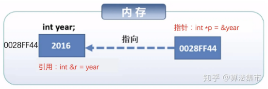
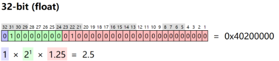
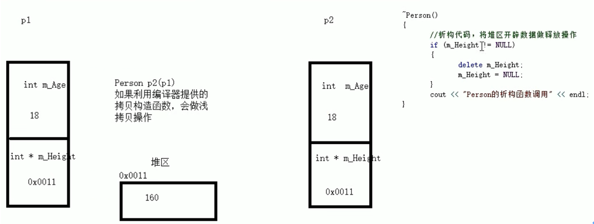
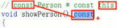
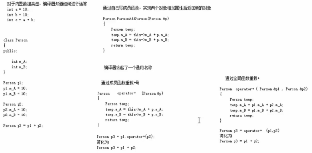
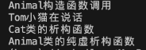

# 1. 简介
1、面向对象程序设计

面向对象的四大特性

1）封装

2）继承

3）多态

4）抽象

2、标准库

标准C++由三个部分组成

1）核心语言：提供了所有的构件块

2）C++标准库：提供了大量的函数

3）标准模版库（STL）：提供了大量的方法

# 2. 基本语法

## 2.1 变量
变量的作用：变量存在的意义，方便操作内存中的数据。

（1）内存中的数据可以通过`内存地址编号`得到；

（2）给内存起名称（变量）方便管理这段内存。

变量的定义、变量的声明：

变量可以**多次声明**，但是只能被**定义一次**。

可以使用**extern**关键字在**任何地方**声明一个变量。

```c++
#include <iostream>
using namespace std;

// 变量声明
extern int a;
extern double b;

int main()
{
    // 变量定义
    int a;
    double b;

    // 实际初始化
    a = 10;
    b = 20.0;

    cout << a << endl;

    cout << b << endl;

    return 0;
}
```

## 2.2 常量
常量：记录程序中不可修改的数据（onlyread）。

定义常量的两种方式

（1）`#define 常量名 常量值           // 通过宏进行定义。`

（2）`const 数据类型 常量名 = 常量值  // const修饰的变量`

## 2.3 关键字（keyword）
关键字（标识符）

### 标识符命令规则
（1）不能是关键字

（2）只能是数字、字母、下划线

（3）第一个字符必须为字母或者下划线

（4）标识符中字母区分大小写

### typedef关键字
`using/typedef`两者都是为已有的类型（int/bool/char/类/结构体/枚举…）定义一个新的名称。

`typedef`是`C`语言中的，但是在C++中仍然支持。using是`C++ 11`中引入的关键字。

```c++
typedef type newname;   // typedef仅可以用作声明type alias，using还可以用作alias template
```

例如：`typedef int feet;    // feet是int类型的一个新名称`

### using关键字
```c++
using ReductionDevice = cutlass::reduction::device::ReduceSplitK<ReductionKernel>;
using ReductionStrideIndex = typename ReductionDevice::StrideIndex;
```
这两句分析

`cutlass::reduction::device::ReduceSplitK<ReductionKernel>`为这个类型起别名`ReductionDevice`。

这里使用`typename` 是因为编译器不确定`ReductionDevice`类型的`StrideIndex`**成员**是类型成员，还是值成员，**使用`typename`明确告诉编译器`StrideIndex`是一个类型**。

```c++
class ClassOne
{
    int w;

protected:
    int a;
};

ClassTwo
{
public:
    using ModuleType = ClassOne;
};

template <typename ClassType>
class ClassThree : private ClassType
{
    using typename ClassType::ModuleType;       // 没有为类型起别名，明确告诉编译器ModuleType是一个类型成员，不是值成员

    ModuleType m;

    ClassThree() = default;

    virtual ~ClassThree() = default;
};

void main()
{
    ClassThree<ClassTwo>::ModuleType a;
}
```

参考：[C++ keyword:using](https://en.cppreference.com/w/cpp/keyword/using)

### `static` 关键字
`static`被用来控制变量和函数的存储方式（生存期）和可见性（作用域）；

1、静态全局变量，普通全局变量

普通全局变量：默认是**静态存储方式**（即在整个程序的生命周期内存在）。普通全局变量的作用域是整个程序，因此可以在其他文件中通过`extern`访问。

静态全局变量：加上`static`，静态全局变量，将其**作用域**限制在定义它的文件中。隐藏它，不可以在其他文件中使用`extern`访问。

2、静态局部变量，普通局部变量

普通局部变量：普通局部变量在每次函数调用时都会重新初始化，当函数返回后，局部变量的生命周期结束，其值不再保留。

静态局部变量：具有静态存储方式，即在整个程序运行期间都存在。静态局部变量在第一次初始化后保持其值，而不像普通局部变量每次函数调用都会重新初始化。

2、指定别名

3、`static`函数和普通函数

`static`函数在**内存中只有一份**，普通函数**在每个被调用的源文件中维持一份拷贝**。

在子类中引用基static修饰全局函数：将全局函数的可见性限制在定义它的文件中，即使其他文件中使用相同名称的全局函数也不会引起冲突。

类的static成员变量和函数：使得它们**属于类本身而不是类的实例**，**这些成员变量或函数可以通过类名访问**而不需要创建类的实例。

普通全局函数：可以被其他文件通过extern声明访问，其作用域不限于当前文件。

### `volatile`关键字
因为访问寄存器比访问内存单元快得多，因此**编译器一般会减少内存存取**（内存存取优化），但有可能读取脏数据。

`volatile` 用于**告诉编译器，被修饰的变量在编译器优化时（不被优化） 不可被省略、重排或缓存**。通常用于以下情况：

用于描述硬件寄存器或内存映射的变量，因为这些变量的值可能在程序之外被修改。

用于多线程环境中，用于描述**被多个线程访问的变量，以避免编译器优化引起的问题**。

在信号处理中，用于保证信号处理函数中对变量的访问不会被优化掉。

### `const`关键字
**简单来说就是“readonly**”

`const` 用于**创建不可变的常量，可以修饰变量、指针、引用以及类成员函数**。

修饰变量：创建不可变的变量，一旦初始化后，其值不能再次修改。

修饰指针：使指针指向的数据不可修改。

修饰引用：**创建只读引用**，不允许通过引用修改所引用的变量。

修饰类成员函数：表示该成员函数不会修改对象的状态（不会修改成员变量）。

## 2.4 数据类型
**数据类型存在的意义**：给变量分配一个合适的内存空间。
### 2.4.1 类型修饰符

```c++
signed

unsigned

short

long

long long
```

### 2.4.2 基本内置类型

```c++
bool  1

char  1

int   4

float   4

double   8

void   无类型

wchar_t   宽字符型
```

注意⚠️：使用`endl`，在每一行后会插入一个换行符，<<用于向屏幕传递多个值

1、 整型（integer）

2、 实型（浮点型）

默认情况下输出一个小数，会显示6位有效数字。

（1）单精度float     4。    float f1 = 3.14f;   // 这里的**f代表前面的float**。默认情况下编译器把小数当成双精度，会去进行类型转换

（2）双精度double    8

3、 字符型

'`a`' 对应的ASCII码是97

'`A`' 对应的ASCII码是65

`char` 1

字符型变量并不是把字符本身存储到内存中存储，而是将对应的ASCII编码放入到存储单元中。

作用：用于表示单个字符

**注意**：
1）使用单引号括起来

2）单引号里只能有一个字符，不可以是字符串。

查看字符型变量对应的ASCII码

```c++
ch = 'a';

cout << (int)ch << endl;  // 97
```

4、 字符串类型（使用双引号）

C语言风格的字符串：`char 变量名[] = "字符串值"`

C++语言风格的字符串：`string 变量名 = "字符串值"`。需要一个头文件 `#include <string>`

5、 布尔类型bool

`bool 1`

6、 转义字符

```c++
\n

\t

\v

\c

\r
```

### 2.4.4 枚举（enumeration）类型
一个变量只有几种可能的值，则可以定义为枚举类型。（即将变量的值一一列举出来，变量的值只能在列举出的值的范围内）

例子：

```c++
enum color { red, green = 5, blue } c;

c = blue; 
```

说明：创建枚举类型color的变量c，并为c赋值为blue。

### 2.4.5 类型转换
将一个类型转换为另一个类型

四种类型转换：

（1）静态转换（Static Cast）

（2）动态转换（Dynamic Cast）

（3）常量转换（Constant Cast）

（4）重新解释转换（Reinterpret Cast）

确实，C++提供了四种类型转换运算符，每种都有其特定的用途。下面简要介绍这四种转换以及它们的应用场景：

1、静态转换（Static Cast）: 

语法：`static_cast<TargetType>(expression)`

使用场景：它是最通用的转换形式，用于将一种类型转换为另一种类型，例如基本数据类型的转换（如 `float` 转 `int`），指向基类的指针或引用转为指向派生类的指针或引用等。

注意：此转换在编译时进行检查，但不执行运行时类型检查。

```cpp
float f = 3.14;
int i = static_cast<int>(f);  // i will be 3
```

2、动态转换（Dynamic Cast）:
语法：`dynamic_cast<TargetType>(expression)`

使用场景：主要用于处理多态时的指针和引用转换。它在运行时进行检查以确保所请求的转换是安全的和有效的。

注意：此转换通常用于将基类指针转换为派生类指针。

```cpp
class Base {};
class Derived : public Base {};
Base *b = new Derived;
Derived *d = dynamic_cast<Derived*>(b);  // Safe conversion
```

3、常量转换（Constant Cast）:

语法：`const_cast<TargetType>(expression)`

使用场景：用于修改表达式的常量性，例如从`const`类型转换为非`const`类型或从`volatile`类型转换为非`volatile`类型。

注意：这只改变类型的`const`或`volatile`属性，并不改变实际数据。

```cpp
const int ci = 10;
int* nonConstIntPtr = const_cast<int*>(&ci);
```

4、重新解释转换（Reinterpret Cast）:

语法：`reinterpret_cast<TargetType>(expression)`

使用场景：对任何指针或整数类型进行低级别的强制类型转换。它的用途通常是将一种类型的指针转换为另一种类型的指针。

注意：此转换可能是不安全的，因为它不进行任何类型检查或转换，只是简单地告诉编译器将数据重新解释为另一种类型。

```cpp
int i = 10;
void*ptr = reinterpret_cast<void*>(&i);
```

请注意，尽管C++提供了这些强制转换运算符，但最佳实践是尽量避免使用它们，除非在某些必要的情况下。当可能的时候，总是首选C++提供的安全和自动的类型转换。

2、数据输入/输出

```cpp
cin >> a;

cout >> "Hello" >> endl;
```

## 2.5 运算符
### 2.5.1 算数运算符
两个整数相除结果依然是整数

只有整型（int）变量可以进行取模运算

**`++/--`区别：**

`++` 前置递增/后置递增

`--`前置递减/后置递减

前置后置的区别：

前置，先进行变量的加1减1操作，然后进行**表达式的计算**。

后置，先进行表达式的计算，然后进行变量的加1减1操作。
```c++
#include <iostream>
using namespace std;

int main(int argc, char const *argv[])
{
    int a = 5;
    int b = a++;
    int c = ++a;
    cout << a << endl;
    cout << b << endl;
    cout << c << endl;
    return 0;
}

/*
输出:

7
5
7
*/
```

### 2.5.2 关系运算符
### 2.5.3 逻辑运算符

```c++
&& 与

|| 或

!  非
```

注意⚠️：在C++中除了0都为真。

### 2.5.4 位运算符
**位运算符作用于位，并逐位执行操作。**

`&`、`|`、`^`（按位**与**运算符、按位**或**运算符、按位**异或**运算符）

`~`、`<<`、`>>`（**取反**运算符、二进制**左移**运算符、二进制**右移**运算符）

### 2.5.5 杂项运算符
1）`sizeof`：`sizeof`运算符 返回变量的大小

2）`Condition ? X : Y` 条件运算符（三目运算符）

3）`.`（点）和`->`（箭头）：成员运算符用于引用类、结构和共用体的成员。【访问结构的成员时使用点运算符，通过指针访问结构的成员时，使用箭头运算符】

4）`Cast`：强制转换运算符

5）`&`：指针运算符`&` 返回变量的地址

6）`*`：指针运算符`*`   指向一个变量

# 3. 程序流程结构
顺序结构

选择结构

循环结构
## 3.1 选择结构
1、1 三目运算符

`表达式1 ? 表达式2 : 表达式3`

1、2 `if`

1、3 `switch...  case...`
## 3.2 循环结构
### 3.2.1 `while`
```c++
#include <iostream>
using namespace std;

// time系统时间头文件
#include <ctime>

int main(){
    // 1、生成一个随机数
    // 添加随机数种子 作用利用当前系统时间生成随机数，防止每次随机数一样的问题出现（伪随机数的出现）
    srand((unsigned int)time(NULL));

    int num = rand() % 100 + 1;  // 这样生成的是伪随机数。需要添加随机数种子，进行生成可以防止生成伪随机数。

    while (1)
    {
        int val = 0;
        cin >> val;

        if (val > num)
        {
            cout << "猜测的数字过大" << endl;
        }
        else if (val < num)
        {
            cout << "猜测的数字过小" << endl;
        }
        else if (val == num)
        {
            cout << "恭喜您！猜对了" << endl;
            // 猜对之后退出猜测游戏。退出当前循环。

            break;
        }
    }

    return 0;
}
```

### 3.2.2 `do...while`
`do...while`与`while`的区别是`do...while`会先执行一次循环语句，再判断循环条件。

```c++
#include <iostream>
using namespace std;

int main(){
    // 输出0～9数字
    int num = 0;
    do
    {
        cout << num << endl;   // 先执行一次循环输出0，再判断循环条件。
        num++;
    }
    while (num < 10);

    return 0;
}
```

### 案例 水仙花数
水仙花数是三位数。每个位上的数字求三次幂之后，相加等于这个三位数。

例如：$1^3 + 5^3 + 3^3 = 153$

利用`do...while`求出所有3位数中的水仙花数。

```c++
#include <iostream>
using namespace std;

/*
水仙花数
水仙花数是三位数。每个位上的数字求三次幂之后，相加等于这个三位数。

例如：1^3 + 5^3 + 3^3 = 153
利用do...while求出所有3位数中的水仙花数。
*/
int main(){
    /*
    1、打印所有三位数
    2、从所有三位数中找到水仙花数
    */

    int num = 100;
    do
    {
        // 2.1 获取三位数的个位、十位、百位上的数字。
        int a = 0;
        int b = 0;
        int c = 0;

        a = num % 10;       // 获取三位数的个位上数字
        b = num / 10 % 10;  // 获取三位数的十位上数字。整数相除得到的也是整数。
        c = num / 100;      // 获取三位数的百位上数字

        // 2.2 判断是否是水仙花数，是则输出这个数字。
        if ((a * a * a + b * b * b + c * c * c)==num)
        {
            cout << num << endl;
        }
        num++;
    } while (num < 1000);

    return 0;
}
```

### 3.2.3 `for`循环
### 案例 敲桌子
```c++
#include<iostream>
using namespace std;

/*
敲桌子
0～100数字。个位、十位有7，或者是7的倍数，敲桌子。
如果不是，输出这个数字。
*/

int main(){
    // 1、输出0～100的这些数字。
    for (int i = 0; i <= 100; i++)
    {
        // 2、找出特殊数字，输出“敲桌子”
        if (i % 7 == 0 || i % 10 == 7 || i / 10 == 7)
        {
            cout << "敲桌子" << endl;
        }
        else
        {
            cout << i << endl;
        }
    }

    return 0;
}
```

### 3.2.4 嵌套循环
### 实例 打印乘法口诀表
```c++
#include <iostream>
using namespace std;

int main(){
    for (int i = 1; i <= 9; i++)
    {
        for (int j = 1; j <= i; j++)
        {
            int eq = i *j;
            cout << j << " *" << i << " = " << eq << " ";
        }
        cout << endl;
    }

    return 0;
}
```


## 3.3 跳转语句（`break/continue`）
### 3.3.1 `break`语句
作用：跳出整个选择结构或者整个循环结构

`break`使用的时机

（1）、出现在`switch`循环中。作用是终止`case`并跳出`switch`

（2）、出现在`for`循环中。作用是跳出当前循环

（3）、出现在嵌套循环语句中。跳出最近的内部循环语句

案例 嵌套循环 `switch`语句 `break`

```c++
#include <iostream>
using namespace std;

int main(){
    cout << "请选择难易程度" << endl;
    cout << "1、简单程度" << endl;
    cout << "2、中等程度" << endl;
    cout << "3、困难程度" << endl;

    int select = 0;
    cin >> select;

    switch (select)
    {
    case 1:
        std::cout << "简单" << std::endl;   // ”std::”说明 cout是属于std命名空间中的函数，而不是其他命名空间中的函数。
        break;

    case 2:
        std::cout << "中等" << std::endl;
        break;

    case 3:
        std::cout << "困难" << std::endl;
        break;

    default:
        break;
    }

    return 0;
}
```

注意：这里的“`::`”是：作用域解析运算符。

作用：用于指定某个标识符（变量、函数、类型等）所属的作用域或命名空间。

案例 `break`的作用

```c++
#include <iostream>
using namespace std;

int main(){
    for (int i = 1; i <= 10; i++)
    {
        for (int j = 1; j <= 10; j++)
        {
            if (j == 5)
            {
                break;
            }

            cout << "*";
        }

        cout << endl;
    }

    return 0;
}
```

### 3.3.2 `continue`
跳出循环中的本次循环，不再向下执行本次循环，执行下一次循环。

```c++
#include<iostream>
using namespace std;

int main(){
    for (int i = 0; i <= 100; i++)
    {
        if (i % 2 == 0) // 对2取模为0表示这个数是偶数
        {
            continue;  // 跳出本次循环，进行下一次的循环
        }
        cout << i << endl;
    }

    return 0;
}
```

### 3.3.3 `goto`
跳转到另一部分代码进行执行。

# 4. 一维数组和指针
数组名含义：指向数据首地址的指针

## 4.1 指针的算数运算
**`&` 取地址符：`&`返回的是一个变量的首地址，或者说是返回的是指向这个变量的指针（指向这个变量的首地址）。**

```c++
#include <iostream>
using namespace std;

int main(){
    char a;
    double b;

    cout << "a的地址是" << (long long)&a << endl;  // 获得指向该变量的指针（存储的是该变量的首地址）
    cout << "a的地址+1值是" << (long long)(&a + 1) << endl;  //
    cout << "b的地址值是" << (long long)&b << endl;  // 首地址
    cout << "b的地址+1值是" << (long long)(&b + 1)<< endl;  // 首地址

    return 0;
}

/*
a的地址是6128757771
a的地址+1值是6128757772
b的地址值是6128757760
b的地址+1值是6128757768
*/
```

## 4.2 数组的地址
```c++
#include <iostream>
using namespace std;

int main(){
    int arr[5];

    cout << "arr的首地址" << (long long)&arr << endl;
    cout << "a[0]的地址是" << (long long)&arr[0] << endl;
    cout << "a[1]的地址是" << (long long)&arr[1] << endl;
    cout << "a[2]的地址是" << (long long)&arr[2] << endl;
    cout << "a[3]的地址是" << (long long)&arr[3] << endl;
    cout << "a[4]的地址是" << (long long)&arr[4] << endl;
    cout << "a[0] + 1的值是" << (long long)(&arr[0] + 1) << endl;

    // 对指针进行算数运算
    int* p = arr;

    cout << " " << p + 0 << endl;

    cout << " " << p + 1 << endl;

    cout << "p + 0的值" << (long long)(p + 0) << endl;

    cout << "p + 1的值" << (long long)(p + 1) << endl;

    cout << "p + 2的值" << (long long)(p + 2) << endl;

    return 0;
}

/*
arr的首地址6165801972
a[0]的地址是6165801972
a[1]的地址是6165801976
a[2]的地址是6165801980
a[3]的地址是6165801984
a[4]的地址是6165801988
a[0] + 1的值是6165801976
` `0x16f82abf4

` `0x16f82abf8
p + 0的值6165801972
p + 1的值6165801976
p + 2的值6165801980
*/
```

**注意的点：**

1、 数组的特点：

1）存放具有相同数据类型的元素；

2）数组元素存放在连续的内存空间中。

2、 一维数组的三种定义方式

3、 通过下标访问数组中的数据

4、 利用循环的方式输出数组中的元素。

```c++
int arr[5] = {val1, val2, val3};
```
输出后的`arr[3] = 0` , `arr[4] = 0`。

**5、 一维数组名的两种用途：**

1）统计数组在内存中的长度；

```c++
sizeof(arr);
```

2）**获取数组在内存中的首地址**。

```c++
cout << arr << endl;
```

## 练习1: 寻找小猪体重最大的值
```c++
#include <iostream>
using namespace std;

int main(){
    int max = 0;
    int arr[5] = {300, 350, 500, 400, 250};
    for (int i = 0; i < 5; i++)
    {
        if (arr[i] > max)
        {
            max = arr[i];
        }
    }
    cout << "最重的小猪体重为：" << max << endl;

    return 0;
}
```

## 练习2: 数组元素逆置（首尾元素互换）
```c++
#include<iostream>
using namespace std;

int main(){
    int arr[] = {21, 78, 11, 54, 12};
    int start = 0;
    int end = sizeof(arr) / sizeof(arr[0]) 1;
    while (start < end)
    {
        int temp = arr[start];
        arr[start] = arr[end];
        arr[end] = temp;
        start++;
        end--;
    }

    for (int i = 0; i < 5; i++)
    {
        /*code */

        cout << arr[i] << endl;
    }

    return 0;
}
```

## 4.3 数组和指针的关系
**数组名相当于指向数组首元素的指针**

```c++
#include <iostream>
int main() {
    int arr[5] = {1, 2, 3, 4, 5};

    // 使用数组名来访问数组元素
    std::cout << "Array elements using array name:" << std::endl;
    for (int i = 0; i < 5; i++)
    {
        std::cout << arr[i] << " ";
    }
    std::cout << std::endl;

    // 使用指针来访问数组元素
    int* ptr = arr; // 将数组名赋给指针
    std::cout << "Array elements using a pointer:" << std::endl;

    for (int i = 0; i < 5; i++)
    {
        std::cout << ptr[i] << " ";
    }
    std::cout << std::endl;

    return 0;
}

/*
数组名可以视为指向数组首元素的指针。
*/
```

## 4.4 数组特定位置元素地址获取
lds是一个一维数组，数组名代表是数组首元素的地址，访问特定元素的地址需要取地址符（&）。

```c++
__shared__ float lds[64 * 64];

float *ldsb = lds;

float *ldsa = &lds[(BLK_DEAL_OUT_C *LDS_DEPTH)];
```

# 5. 二维数组
## 5.1 二维数组的定义/输出
```c++
#include<iostream>
using namespace std;

int main(){
    // 二维数组的定义
    // 1、第一种定义方式
    int arr01[2][3] = {{1, 4, 2}, {7, 10, 3}};

    // 2、第二种定义方式
    int arr02[2][3];
    arr02[0][0] = 1;
    arr02[0][1] = 4;

    // 3、第三种定义方式
    int arr03[2][3] = {1, 4, 2, 7, 10, 3};

    // 4、第四种定义方式
    int arr04[][3] = {1, 4, 2, 7, 10, 3}; // 可省略行数，但是列数不能省略

    // 二维数组的输出
    for (int i = 0; i < 2; i++)
    {
        for (int j = 0; j < 3; j++)
        {
            cout << arr01[i][j] << " ";
        }
    }
}
```

## 5.2 二维数组的数组名的作用
1）二维数组占用的内存空间

```c++
sizeof(arr)
```

2）二维数组的首地址

cout << arr << endl;

```c++
#include<iostream>
using namespace std;

int main(){
    int arr[2][3] = {{1, 4, 2}, {7, 10, 3}};

    // 数组名的作用
    // 1. 数组占用的内存空间
    cout << "二维数组占用的内存空间：" << sizeof(arr) << endl;
    cout << "二维数组第一行元素占用的内存空间：" << sizeof(arr[0]) << endl;
    cout << "二维数组第一个元素占用的内存空间：" << sizeof(arr[0][0]) << endl;
    cout << "二维数组的行数：" << sizeof(arr) / sizeof(arr[0]) << endl;

    // 2. 查看二维数组的首地址
    cout << "二维数组的首地址 " << (long)arr << endl;
    cout << "二维数组的第一行的首地址 " << (long)arr[0] << endl;
    cout << "二维数组的第二行的首地址 " << (long)arr[1] << endl;
    cout << "二维数组的第一个元素的首地址 " << (long)&arr[0][0] << endl;  // 查看一个数的首地址需要加取地址符&
    cout << "二维数组的第二个元素的首地址 " << (long)&arr[0][1] << endl;

    return 0;
}
```

## 实例 成绩的统计
```c++
#include<iostream>
using namespace std;

#include<string>
int main(){
    // 考试成绩的统计

    int scores[3][3] = 

    {
        {100, 100, 100}, 

        {90, 50, 100}, 

        {60, 70, 80}
    };

    string names[3] = {"张三",  "李四", "王五"};

    for (int i = 0; i < 3; i++)
    {
        int sum = 0;

        for (int j = 0; j < 3; j++)
        {
            sum += scores[i][j];
        }   

        cout << names[i] << "的总分：" << sum << endl;
    }

    return 0;
}
```

# 6. 函数
作用：将一段经常使用的代码进行封装，减少重复代码
## 6.1 函数的定义/调用
实现一个加法函数，功能：传入两个整型数据，计算数据相加的结果，并且返回。

```c++
// 定义加法函数
// num1和num2为形参
int add(int num1, int num2)   // 返回值类型 函数名（参数列表）{函数体 return表达式}
{
    int sum = num1 + num2;

    return sum;
}

#include<iostream>
using namespace std;
int main(){
    int a = 7;
    int b = 8;

    // a,b为实参
    int sum = add(a, b);
    cout << sum << endl;

    return 0;
}
```

## 6.2 值传递
值传递就是函数调用时实参将数值传入给形参

值传递时，如果**形参发生变化，并不影响实参**

```c++
#include<iostream>
using namespace std;

// 函数之“值传递”
void swap(int num1, int num2){
    cout << "交换前的值";
    cout << "num1的值:" << num1 << endl;
    cout << "num2的值:" << num2 << endl;
    cout << "交换后的值";

    int temp = num1;
    num1 = num2;
    num2 = temp;
    cout << "num1的值:" << num1 << endl;
    cout << "num2的值:" << num2 << endl;

    return;  // 当函数返回值类型为void时， 可以不写，也可这样写
}

int main(){
    int a = 10;
    int b = 22;
    swap(a, b);

    cout << "值传递时，如果形参发生任何改变，并不影响实参" << endl;
    cout << "a的值:" << a << endl;
    cout << "b的值:" << b << endl;

    return 0;
}
```

## 6.3 函数的样式
1、无参无返

2、无参有返

3、有参无返

4、有参有返
## 6.4 函数的声明
可以将函数往主函数后面写，提前使用函数声明告诉编译器这个函数是存在的。

```c++
#include <iostream>
using namespace std;

// 函数声明

// 提前告诉编译器函数的存在，可以利用函数的声明

int max(int num1, int num2);

int main(){
    int a = 10;

    int b = 20;

    cout << max(a, b); 

    return 0;
}

int max(int num1, int num2)
{
    return num1 > num2 ? num1 : num2;  // 三目运算符
}
```

## 6.5 函数分文件编写
作用：让代码结构更加清晰

函数分文件编写步骤：

1）创建.h头文件

2）创建.cpp源文件

3）在.h头文件中写函数的声明

4）在.cpp源文件中写函数的定义

swap.h

```c++
#include <iostream>
using namespace std;

void swap(int a, int b);
```
swap.cpp

```c++
#include “swap.h”

void swap(int a, int b)
{
    int tmp = a;

    int a = b;


    int b = tmp;

    cout << “a = ” << a << endl;

    cout << “b = ” << b << endl;
}
```
func.cpp

```c++
#include “swap.h”

int main()
{
    int a = 10;

    int b = 12;

    swap(a, b);

    return 0;
}
```

# 7. 指针
指针的作用：通过指针**间接访问内存**

**指针存储的是内存地址（另一个变量的首地址）**

内存编号从0开始记录，一般使用**十六进制**数字表示

利用指针变量保存地址

## 7.1 指针变量的定义/使用
```c++
#include <iostream>
using namespace std;

int main()
{
    // 1、指针的定义

    int a = 10;

    // 指针定义的语法：数据类型 *指针变量名

    int *p;

    // 让指针指向变量a的首地址

    p = &a;

    cout << "a的首地址为:" << &a << endl;

    cout << "指针p为:" << p << endl;

    // 2、使用指针

    // 通过解引用的方式找到指针指向的内存

    // 指针前加 *代表解引用，找到指针指向的内存中的数据

    *p = 1000;

    cout << "a = " << a << endl;

    cout << "*p = " << *p << endl;

    return 0;
}

/*

a的地址为:0x16b3b2ba8

指针p为:0x16b3b2ba8

a = 1000

*p = 1000

*/
```

```c++
#include <stdio.h>
int main()
{
    int x = 10;

    int *p = &x;

    printf("x 的值： %d\n", x);

    printf("x 的首地址（地址）： %p\n", &x);

    printf("p 的值（x的地址/首地址）： %p\n", p);

    printf("* p 的值： %d\n", *p);


    return 0;
}

// x 的值： 10
// x 的首地址（地址）： 000000000061FE14
// p 的值（x的地址/首地址）： 000000000061FE14
// * p 的值： 10

```

## 7.2 指针占用的内存空间
指针也是一种**数据类型，占用内存空间多大**？（指针这种数据类型占用的内存大小）

在32位操作系统下占用：4个字节

在64位操作系统下占用：8个字节

```c++
#include <iostream>
using namespace std;

int main()
{
    int a = 10;

    int *p = &a;

    // 查看指针数据类型占用的内存空间（注意在64/32位操作系统下，占用内存空间不同）

    cout << "sizeof(int *) = " << sizeof(int *) << endl;

    cout << "sizeof(double *) = " << sizeof(double *) << endl;

    return 0;
}
```

## 7.3 空指针和野指针
### 7.3.1 空指针
空指针：指针变量指向**内存编号为0**的空间

用途：初始化指针变量 int *p = NULL;

注意：空指针指向的内存不能访问

```c++
// 指针变量p指向内存地址编号为0的空间
int *p = NULL;

// 访问空指针报错

// **内存编号0～255为系统占用内存，不允许用户访**问
```

### 7.3.2 野指针/悬空指针
野指针：指针变量指向非法内存空间。**不确定指针具体指向**。

悬空指针：指针变量最初指向的内存已经被释放的指针。

注意：野指针/空指针都不是我们申请内存空间，因此不要访问。

## 7.4 const修饰指针
`const`修饰指针的3种情况：

1、`char* const cp;`

`const`修饰的`cp`在里面，所以cp指向的地址是不能改变的，但它所指向的内容是可以改变的；**指针常量**

2、`char const*pc1;`

`* pc1`被`const`所修饰，也就是指针所指向的对象，所以它指向的对象是不能改变的，但是它指向的地址是可以改变的；**常量指针**

3、`const* const ptr`

特点：指针指向不可以修改，值也不可以修改

## 7.5 指针和数组
作用：指针访问数组元素

注意：`ptr++;` // ++操作 数组申请的是连续的内存空间，当`ptr++`（**ptr是int类型的指针变量**），地址空间向后偏移是以int类型的大小为单位进行偏移的（**因为指针是int类型的**），相当于int类型数组元素的向后偏移

```c++
#include <iostream>
using namespace std;

int main()
{
    int arr[10] = {11, 92, 24, 51, 78, 19, 20, 45, 61, 78};
    int* ptr = arr; // 指向数组的指针（即指针指向数组首元素的的首地址）

    cout << arr << endl;
    cout << &arr[1] << endl;
    cout << sizeof(int* ) << endl;

    for (int i = 0; i < 10; i++)
    {
        cout << *ptr << endl;  // 指针解引用
        ptr++;     // 指针在数组中的指向的地址向前移动
    }
}
```
## 7.6 指针和函数
**参数传递的两种方式：**

1、值传递

2、地址传递

```c++
#include <iostream>
using namespace std;

void swap01(int a, int b);

void swap02(int *p1, int *p2);

int main()
{
    int a = 20;
    int b = 31;

    // 1、值传递
    swap01(a, b);
    cout << "a = " << a << endl;
    cout << "b = " << b << endl;

    // 2、地址传递
    // 如果是地址传递，可以修饰实参
    swap02(&a, &b);
    cout << "a = " << a << endl;
    cout << "b = " << b << endl;
}

void swap01(int a, int b)
{
    int temp = a;
    a = b;
    b = temp;
    cout << "swap01 a = " << a << endl;
    cout << "swap01 b = " << b << endl;
}

void swap02(int *p1, int *p2)
{
    int temp = *p1;
    *p1 = *p2;
    *p2 = temp;
    cout << "swap02 *p1 = " << *p1 << endl;
    cout << "swap02 *p2 = " << *p2 << endl;
}
```

## 7.7 指针、数组、函数
数组名可以表示数组的首地址，即int *arr = arr
## 实例
实例描述：封装一个函数，利用冒泡排序，实现对整型数组的升序排序

```c++
#include <iostream>
using namespace std;

void bubblesort(int *arr, int len);

void printArray(int *arr, int len);

int main()
{
    int arr[5] = {1, 10, 42, 3, 0};

    int len = sizeof(arr) / sizeof(arr[0]);

    bubblesort(arr, len);   // 数组名可以表示数组的首地址，即int *arr = arr;

    printArray(arr, len);
}

void bubblesort(int *arr, int len)
{
    for (int i = 0; i <= len 1; i++)
    {
        for (int j = 0; j < len i 1; j++)
        {
            if (arr[j] > arr[j + 1])
            {
                int temp = arr[j];

                arr[j] = arr[j + 1];

                arr[j + 1] = temp;
            }
        }
    }
}

void printArray(int *arr, int len)
{
    for (int i = 0; i < 5; i++)
    {
        cout << arr[i] << endl;
    }
}
```

## 7.8 多级指针

```c++
int a = 10; // 定义一个整型变量 a
int *p = &a; // 定义一个指针 p，它指向 a 的地址
int q = &p; // 定义一个二级指针 q，它指向 p 的地址

cout << a << endl; // 输出 a 的值，为 10
cout << *p << endl; // 输出 p 所指向的变量的值，为 10
cout << q << endl; // 输出 q 所指向的指针所指向的变量的值，为 10
```

## 7.9 智能指针
自动垃圾回收（**自动管理生存期，防止内存泄漏**）

智能指针的分类和用法:
在C++中，智能指针是一种对象，它表现得像指针，但有自动内存管理的功能。当智能指针被销毁或超出作用范围时，它指向的内存会被自动释放。下面是C++中最常见的三种智能指针及其用法示例：

1、`std::unique_ptr`

`std::unique_ptr` 是一种**独占式智能指针**，它指向的对象在任何时刻都是唯一的，没有其他的智能指针可以指向相同的对象。当 `unique_ptr` 超出作用范围时，它会自动销毁所指向的对象。

示例：

```cpp
#include <memory>
#include <iostream>
class MyClass 
{
public:
    void classMethod() 
    {
        std::cout << "MyClass method called!" << std::endl;
    }
};

int main() 
{
    std::unique_ptr<MyClass> uniquePtr = std::make_unique<MyClass>();
    uniquePtr->classMethod();  // 调用方法

    return 0;
}  // uniquePtr 超出作用范围，其指向的内存被自动释放

```

2、std::shared_ptr

`std::shared_ptr` 是一种**共享式智能指针**，多个 `shared_ptr` 可以指向同一个对象，该对象和其相关资源会在最后一个指向它的 `shared_ptr` 被销毁时释放。

示例：

```cpp
#include <memory>
#include <iostream>

class MyClass {
public:
    ~MyClass()
    {
        std::cout << "MyClass destroyed!" << std::endl;
    }
};

int main() {
    std::shared_ptr<MyClass> sharedPtr1 = std::make_shared<MyClass>();

    {
        std::shared_ptr<MyClass> sharedPtr2 = sharedPtr1;

        // 此时，sharedPtr1 和 sharedPtr2 都指向同一个对象
    }  // sharedPtr2 超出作用范围，但由于 sharedPtr1 仍然存在，所以对象不会被销毁

    return 0;
}  // sharedPtr1 超出作用范围，它指向的对象现在被销毁

```

3、std::weak_ptr

`std::weak_ptr` 是一种**非拥有性智能指针**，它指向一个由 `std::shared_ptr` 管理的对象，但不增加该对象的**引用计数**。`weak_ptr` 主要用来解决 `shared_ptr` 之间的循环引用问题。

示例：
```cpp

#include <memory>
#include <iostream>

class MyClass {
public:
    ~MyClass() 
    {
        std::cout << "MyClass destroyed!" << std::endl;
    }
};

int main() {
    std::weak_ptr<MyClass> weakPtr;

    {
        std::shared_ptr<MyClass> sharedPtr = std::make_shared<MyClass>();

        weakPtr = sharedPtr;

        // 在这里，由于 weakPtr 不增加引用计数，所以即使 weakPtr 存在，

        // 当 sharedPtr 超出作用范围时，它指向的对象也会被销毁。
    }  // sharedPtr 超出作用范围

    // 在这里，由于对象已被销毁，因此 weakPtr 现在为空。

    if (weakPtr.expired()) {
        std::cout << "Object pointed to by weakPtr has been destroyed." << std::endl;
    }

    return 0;
}

```

可以看到不同类型的智能指针是如何在不同情况下管理内存的。**使用智能指针可以自动管理内存，确保在合适的时间释放对象占用的内存**，**减少内存泄漏（已分配内存，未进行释放，且程序已经失去对这部分内存的控制或引用，无法使用或释放它）**的风险。

4、auto，C++11已经弃用

### 7.9.1 智能指针的底层实现
智能指针在 C++ 中是一个类，其目的是模仿原生指针的行为，同时提供自动化的内存管理。智能指针的底层实现依赖于 **C++ 的对象和内存管理特性**，包括**构造函数、析构函数、重载的操作符等等**。这里我们以两种最常见的智能指针为例，详细说明其底层是如何实现的：

1、`std::unique_ptr`:

`std::unique_ptr` 实现了**独占所有权**的概念，意味着同一时间只有一个 `unique_ptr` 可以指向某个内存区域。当这个 `unique_ptr` 被销毁时，它所指向的内存也会被释放。

核心实现机制：

构造函数：用于绑定到原始指针，获取对应内存的所有权。

**移动构造函数**和**移动赋值操作符**：`unique_ptr` 不能被复制，但可以移动，意味着它们的所有权可以转移。
```c++
// Move constructor
unique_ptr(unique_ptr&& __u) noexcept
      : _M_t(__u.release(), std::forward<deleter_type>(__u.get_deleter())) { }

// Move assignment operator
unique_ptr&
      operator=(unique_ptr&& __u) noexcept{....}
```

析构函数：当 `unique_ptr` 的生命周期结束时，析构函数会自动被调用，释放其指向的内存。

**重载的箭头和解引用操作符**：使 `unique_ptr` 在使用时更接近原始指针。

2、`std::shared_ptr`:

`std::shared_ptr` 实现了共享所有权的概念，允许多个 `shared_ptr` 指向同一个内存区域。`shared_ptr` 使用引用计数来跟踪指向某块内存的智能指针数量。只有当最后一个 `shared_ptr` 不再指向该内存时，该内存才会被释放。

核心实现机制：

构造函数：类似于`unique_ptr`，用于绑定到原始指针。

**拷贝（复制）构造函数和赋值操作符**：允许指针所有权的共享。每次复制时，引用计数会增加。

析构函数：减少引用计数，并在引用计数变为零时释放内存。

**重载的箭头和解引用操作符**：使其行为类似原始指针。

除此之外，`shared_ptr` 通常会使用一个控制块来存储引用计数和其他管理信息。这个控制块是在堆上分配的额外内存，用来跟踪有多少个 `shared_ptr` 和 `weak_ptr`（另一种相关的智能指针，不增加引用计数但可以观察对象）指向同一个资源。

这两种智能指针都是通过 RAII (Resource Acquisition Is Initialization) 模式来管理资源，即在构造时获取资源，在析构时释放资源。通过这种方式，智能指针能有效预防内存泄露，确保在出现异常时资源能被正确释放。

### 7.9.2 智能指针特性的例子
**1、unique_ptr**

```c++
#include <memory>

class MyClass 
{
    int data;

public:
    MyClass(int d) : data(d) {}
};

int main() 
{
    std::unique_ptr<MyClass> ptr1 = std::make_unique<MyClass>(10); // 创建一个指向MyClass的unique_ptr
    // std::unique_ptr<MyClass> ptr2 = ptr1; // 编译错误，因为不能复制unique_ptr

    std::unique_ptr<MyClass> ptr3 = std::move(ptr1); // 现在ptr3拥有对象，ptr1不再指向对象
    // 当ptr3离开作用域时，对象会被自动删除

    return 0;
}
```

**2、`shared_ptr`**

```c++
#include <memory>

int main() 
{
    std::shared_ptr<int> ptr1 = std::make_shared<int>(20); // 引用计数为1
    std::shared_ptr<int> ptr2 = ptr1; // 引用计数增加到2

    ptr2.reset(); // 引用计数减少到1
    // 当ptr1离开作用域时，引用计数变为0，对象被删除

    return 0;
}

```

**3、weak_ptr**

```c++
#include <memory>

int main() 
{
    std::shared_ptr<int> shared = std::make_shared<int>(30);
    std::weak_ptr<int> weak = shared;
    std::shared_ptr<int> shared2 = weak.lock(); // 从weak_ptr创建shared_ptr
    shared.reset(); // 释放对象的所有权

    if(weak.expired()) 
    { // 检查对象是否还活着
        std::cout << "Object has been deleted!" << std::endl;
    }

    return 0;
}
```

## 7.10 指针详解
### 指针类型的作用和解引用的过程
指针类型的作用：

（1）根据指针类型确定读取数据位数（float类型指针，从内存中读取32位）；

（2）根据指针类型解释读取解引用之后的数据（float类型指针，按照1位符号位，8位指数位，23位尾数位解释32位数据，即IEEE 754标准解释）。

指针**解引用**可以分为三步：

（1）取地址：根据指针中存储的地址，定位数据所在内存的首地址；

（2）取数据：根据**指针类型**读取相应大小的数据块（相应数量的二进制位）；

（3）解释数据：根据**指针类型**解释读取到的二进制数据。
### 内存数据的读取和解释

```c++
#include <iostream>

int main(int argc, char const *argv[])
{
    /*
    i的内存首地址：0x61fe14，值是42
    i数据的内存中存储为：00000000 00000000 00000000 00100110
    */

    int i = 42;

    /*
    1. 取地址：取integer_p存储的地址 0x61fe14；
    2. 取数据：根据integer_p的数据类型，取从0x61fe14开始的4个字节（32位）数据
    3. 解释数据：根据integer_p的数据类型，将这32位数据按照int类型解释，得到一个整数
    */

    int *integer_p = &i;                  // 取地址
    std::cout << *integer_p << std::endl; // 取数据，解释数据

    // 42

    /*
    1. 取地址：fp存储的地址 0x61fe14；
    2. 取数据：根据fp的数据类型，从0x61fe14开始的4个字节（32位）数据
    3. 解释数据：根据fp的数据类型，将这32位数据按照float类型解释，得到一个浮点数
    0 00000000 00000000000000000100110
    解释为1位sign，8位exponent，23位mantissa
    */

    float *fp = (float *)&i;       // 取地址
    std::cout << *fp << std::endl; // 取数据，解释数据

    // 5.88545e-44

    /*
    因为指针，存储的是地址，因此这里i被解释为地址
    这里将i解释为“内存地址”大小是42，将其转成float类型的指针，赋值给float类型的指针fp
    内存地址是无效的地址，因为操作系统保留了0~255的内存地址
    */
    float *fp = (float *)i;

    return 0;
}
```

# 8. 引用
## 8.1 指针和引用的不同

引用 r，是 year 的一个别名，在内存中 r 和 year 占有同一个存储单元，指针不同，指针有自己的内存空间。

1）不存在空引用。引用必须连接到一块合法的内存；存在空指针。

**tip**:如果有空引用，那么变量（r）没有内存空间？这是有问题的。存在空指针，是因为指针有自己的内存空间

```c++
int x = 42;

int &ref = x;  // 合法的引用，连接到 x

// int &ref2;  // 错误！引用必须在声明时初始化
```

2）一旦引用被初始化为一个对象，就不能被指向到另一个对象了。指针可以在任何时候指向到另一个对象；

**tip**:引用作为一个变量的别名，如果再作为另一个变量的别名，两块内存地址的名称一致？这是有问题的。

```c++
int a = 10, b = 20;

int &ref = a;  // 引用 ref 连接到 a

// ref = b;    // 错误！不能改变引用 ref 连接的对象

int *ptr = &a;  // 指针 ptr 存储 a 的地址

ptr = &b;      // 合法，指针 ptr 指向了 b
```

3）引用必须在声明时被初始化。指针可以在任何时间被初始化。

**tip**:引用没有内存空间，只是另一个对象的别名（和所引用对象占用同一块空间），如果没有初始化，是有问题的。
```c++
int x = 42;

int &ref = x;  // 创建引用并初始化

// int &ref;   // 错误！引用必须在创建时初始化

int *ptr;      // 创建指针

ptr = &x;      // 指针在稍后初始化为 x 的地址
```

4）引用本身没有地址，只是对象的一个别名。

指针是附属在内存位置上的标签，引用是原变量的别名。可以通过原始变量名称或引用访问变量的内容

通过原始变量名访问变量名称：`int i = 7;`

通过引用：

```c++
int& r = i;   // 将i声明为引用变量
double& s = d;  // 初始化为d的double类型的引用s。
```

## 8.2 实例
```c++
#include <iostream>
using namespace std;

int main()
{
    int i;
    int j;
    int &r = i;
    int &s = d;
    i = 7;

    cout << "i = " << i << endl;
    cout << "r = " << r << endl;

    j = 119;
    cout << "j = " << j << endl;
    cout << "s = " << s << endl;

    return 0;
}
```

## 8.3 引用使用
作用：给变量起别名

数据类型 &别名 = 原名;

**无论操作原名还是别名**都是操作的同一块**内存空间**。

```c++
#include <iostream>
using namespace std;

int main()
{
    int i;
    int j;
    int &r = i;
    int &s = j;

    // 无论对原名还是引用名操作，都是操作的同一块内存
    i = 7;
    cout << "i = " << i << endl;
    cout << "r = " << r << endl;

    j = 119;
    cout << "j = " << j << endl;
    cout << "s = " << s << endl;

    return 0;
}

/*
i = 7
r = 7
j = 119
s = 119
*/
```

## 8.4 引用注意事项
1）引用必须初始化

```c++
int a = 10;

int &b = a;
```

2）引用初始化后不能再改变
```c++
int a = 10;

int b = 12;

int &c = a;

int &c = b; // 这是错误的，引用初始化后不能再进行改变
```

## 8.5 引用作函数参数
作用：函数传参时，利用引用让形参修饰实参。

三种参数传递方式：

1）数值传递

不能修饰实参（不能更改实参地址空间的值，修改的是拷贝的部分）

2）地址传递

可以修饰实参

（1）传入函数的指针是**原指针的一个拷贝**（此时存在两个指针，两个指针指向一个内存空间，同时指向原对象）；

（2）在函数中不改变拷贝指针的指向时，修改拷贝指针指向的值，相当于修改原指针指向的值；

（3）在函数中改变拷贝指针的指向时，只是改变了拷贝指针的指向，不改变原指针的指向，所以不改变原指针指向的对象。

3）引用传递

可以修饰实参

需要初始化才可以使用，初始化后不能更改

（1）引用作为函数参数传递时，实质上传递的是**实参本身**

```c++
#include <iostream>
using namespace std;

// 1、数值传递
void swap01(int a, int b)
{
    int temp = a;
    a = b;
    b = temp;
}

// 2、地址传递
void swap02(int *a, int *b)
{
    int temp = *a;
    *a = *b;
    *b = temp;
}

// 3、引用传递
void swap03(int &a, int &b)
{
    int temp = a;
    a = b;
    b = temp;
}

int main()
{
    int a = 10;
    int b = 20;

/*

// 数值传递
    swap01(a, b);

    cout << a << endl;

    cout << b << endl;

    10

    20

    */

/*

// 地址传递
    swap02(&a, &b);

    cout << a << endl;

    cout << b << endl;

    20

    10

    */

/*

// 引用传递
    swap03(a, b);

    cout << a << endl;

    cout << b << endl;

    20

    10

    */
}
```

## 8.6 引用做函数的返回值
注意：

1)不要返回局部变量（因为局部变量存储在栈区，函数运行结束后编译器释放掉这部分内存）的引用。可以通过给局部变量加static的方式，变成全局变量（全局变量存放在全局区，全局区是在程序运行结束后释放），就可以返回了。

2)函数调用可以作为左值。

```c++
#include <iostream>
using namespace std;

// 不要返回局部变量的引用
int &func()
{
    int a = 10;
    return a;
}

int &func02()
{
    // 通过加static使其存在于全局区，函数执行结束后不会被释放掉这块内存
    static int a = 10;
    return a;
}

int main()
{
    // int &ref = func();
    // cout << ref << endl;
    int &ref = func02();
    cout << ref << endl; // 10
    // 作为左值
    func02() = 1000;     // a = 1000
    cout << ref << endl; // 1000
    return 0;
}
```

## 8.7 引用的本质
引用本质上是 指针常量（指针常量的特点：指向不可以改，值可以改）
## 8.8 常量引用
作用：常量引用主要用于修饰形参，防止误操作。

引用必须引到一块合法的内存空间

```c++
const int &ref = 10;  // 编译器将代码修改为 int temp = 10; const int &ref = temp;

int &ref = 10; // 这样写是错的
```

# 9. 结构体
用户自定义的数据类型，允许用户存储不同的数据类型

```c++
#include <iostream>
using namespace std;

#include <string>
// 结构体的定义

struct Student
{
    string name;

    int age;

    int score;
} stu3;

int main()
{
    // 通过结构体创建结构体变量的三种方式

    // 1、struct 结构体名 变量名;

    // 2、struct 结构体名 变量名 = {成员1值，成员2值};

    // 3、定义结构体时，顺便创建变量

    struct Student stu1; // struct 关键字可以省略

    stu1.name = "张三";

    stu1.age = 12;

    stu1.score = 100;

    struct Student stu2 = {"李四", 42, 98};

    stu3.name = "王五";

    stu3.age = 8;

    stu3.score = 99;

    return 0;
}
```

## 9.1 结构体数组
将自定义的结构体放入到数组中方便维护

```c++
#include <iostream>
using namespace std;

#include <string>
// 结构体

struct student
{
    string name;

    int age;

    int score;
};

int main()
{
    // 2、创建结构体数组

    struct student arr[3] = {
        {"张三", 12, 99},

        {"王五", 54, 100},

        {"李四", 66, 79}};

    // 3、给结构体数组中的元素赋值

    arr[2].name = "赵六";

    arr[2].age = 60;

    arr[2].score = 59;

    // 4、遍历结构体数组

    for (int i = 0; i < 3; i++)
    {
        cout << "name:" << arr[i].name << " age:" << arr[i].age << " score:" << arr[i].score << endl;
    }

    return 0;
}
```

## 9.2 结构体指针
通过“->”访问结构体变量中的成员属性

```c++
#include <iostream>
using namespace std;

// 通过指针访问结构体变量的成员属性值

// 定义结构体

struct student
{
    string name;

    int age;

    int score;
};

int main()
{
    // 创建结构体变量并赋值

    struct student stu = {"张三", 12, 88};

    // 通过指针访问结构体变量的成员属性值

    struct student *p = &stu;

    cout << "name: " << p->name << " age:" << p->age << " score:" << p->score << endl; 

    return 0;
}
```

## 9.3 结构体嵌套结构体
结构体中的成员是另一个结构体

```c++
#include <iostream>
using namespace std;

#include <string>
struct student
{
    string name;

    int age;

    int score;
};

struct teacher
{
    int id;

    string name;

    int age;

    struct student stu;
};

int main()
{
    struct teacher t1;

    t1.id = 11;

    t1.name = "王老师";

    t1.age = 32;

    t1.stu.name = "李学生";

    t1.stu.age = 22;

    t1.stu.score = 88;

    cout << "老师id：" << t1.id << " 老师姓名：" << t1.name << " 老师年龄：" << t1.age << " 学生姓名：" << t1.stu.name << " 学生年龄：" << t1.stu.age << " 学生分数：" << t1.stu.score << endl;

    return 0;
}
```

## 9.4 结构体做函数参数
### 9.4.1 结构体作为 值传递
### 9.4.2 结构体作为 地址传递

```c++
#include <iostream>
using namespace std;

#include <string>
void printArray01(struct student stu);

void printArray02(struct student *p);

// 通过指针访问结构体变量的成员属性值

// 定义结构体

struct student
{
    string name;

    int age;

    int score;
};

int main()
{
    // 创建结构体变量并赋值

    struct student stu = {"张三", 12, 88};

    // 1、值传递

    printArray01(stu);

    // 2、地址传递

    printArray02(&stu);

    return 0;
}

void printArray01(struct student stu)
{
    cout << "name:" << stu.name << " age:" << stu.age << " score:" << stu.score << endl;

    return;
}

void printArray02(struct student *p)
{
    cout << "name: " << p->name << " age:" << p->age << " score:" << p->score << endl;

    return;
}
```

## 9.5 结构体中`const`使用场景
作用：使用`const`防止误操作

```c++
#include <iostream>
using namespace std;

#include <string>
void printArray(struct student *p);

struct student
{
    string name;

    int age;

    int score;
};

int main()
{
    struct student stu;

    stu.name = "张三";

    stu.age = 28;

    stu.score = 100;

    printArray(&stu);

    return 0;
}


void printArray(const struct student*p) // 参数是地址传递(提高代码性能，值传递是对值的复制，如果是指针的话，只需要占用4/8个字节)，如果修改就会修改原始数据，加const防止误修改**
{
    cout << "name:" << p->name << " age:" << p->age << " score:" << p->score << endl;

    return;
}
```

## 9.6 结构体（struct）和共用体（union）的区别
**存储方式的不同**

结构体：所有数据成员都有自己独立的存储空间。大小是所有成员的大小之和（内存对齐）

联合体：所有数据成员共用一块内存空间。大小等于最大的成员的大小。

**应用场景不同**

结构体：定义需要同时存储/访问多个属性的对象。例如：链表、树、图等。

联合体：用来节省内存，多个变量不需要同时存在时。例如：实现多态的数据结构
## 共用体例子(说明所有成员共用一块内存)

```c++
#include <stdio.h>
union Data
{
    int i;

    float f;

    char str[20];
};

int main()
{
    union Data data;

    data.i = 10;

    printf("data.i: %d\n", data.i); // data.i: 10

    data.f = 2.5;

    printf("data.f: %f\n", data.f); // data.f: 2.500000

    printf("data.i: %d\n", data.i); // data.i: 1075838976
}
```

为什么第二次输出data.i的值为1075838976?

因为，共用同一块内存，当将这块内存赋值为2.5时，再输出int i时相当于将float转成int，即32位没有 像float的指数位（exponent）

int计算方式：$1 * 2^{30} + 1 * 2^{21} = 1075838976$


## 案例1

```c++
#include <iostream>
using namespace std;
#include <string>
#include <ctime>
void allocateSpace(struct Teacher t[], int len);
void printInfo(struct Teacher t[], int len);

struct Student
{
    string sName;

    int score;
};

struct Teacher
{
    string tName;

    struct Student sArray[5];
};

int main()
{
    // 随机数种子，使生成随机数的时候，真正随机起来
    srand((unsigned int)time(NULL));
    struct Teacher t[3];

    int len = sizeof(t) / sizeof(t[0]);
    allocateSpace(t, len);
    printInfo(t, len);
}

void allocateSpace(struct Teacher t[], int len)
{
    string nameSeed = "ABCDE";

    for (int i = 0; i < len; i++)
    {
        t[i].tName = "Teacher_";

        t[i].tName += nameSeed[i];

        for (int n = 0; n < 5; n++)
        {
            t[i].sArray[n].sName = "Student_";

            t[i].sArray[n].sName += nameSeed[n];

            t[i].sArray[n].score = rand() % 61 + 40;  // 生成0～60之间的随机数，分数在40～100之间
        }
    }
}

void printInfo(struct Teacher t[], int len)
{
    for (int i = 0; i < len; i++)
    {
        cout << t[i].tName << endl;
        for (int j = 0; j < 5; j++)
        {
            cout << "sName:" << t[i].sArray[j].sName << " score:" << t[i].sArray[j].score << endl;
        }
    }
}
```

## 案例2
创建结构体数组，并按照age进行冒泡升序排序，打印结果

```c++
#include <iostream>
using namespace std;

#include <string>
void printInfo(struct hero hArray[], int len);

void sortArray(struct hero hArray[], int len);

struct hero
{
    string name;
    int age;
    string gender;
};

int main()
{
    struct hero hArray[5] = {
        {"刘备", 23, "男"},
        {"关羽", 22, "男"},
        {"张飞", 20, "男"},
        {"赵云", 21, "男"},
        {"貂蝉", 19, "女"}};

    int len = sizeof(hArray) / sizeof(hArray[0]);

    printInfo(hArray, len);
    sortArray(hArray, len);
    printInfo(hArray, len);
}

void printInfo(struct hero hArray[], int len)
{
    for (int i = 0; i < len; i++)
    {
        cout << "name:" << hArray[i].name << " age:" << hArray[i].age << " gender:" << hArray[i].gender << endl;
    }
}

void sortArray(struct hero hArray[], int len)
{
    for (int i = 0; i < len 1; i++)
    {
        for (int j = 0; j < len i 1; j++)
        {
            if (hArray[j].age > hArray[j + 1].age)
            {
                // 注意这一块，可以直接写成交换数组元素位置的方式
                struct hero temp = hArray[j];
                hArray[j] = hArray[j + 1];
                hArray[j + 1] = temp;
            }
        }
    }
}
```

## 9.7 结构体的构造函数及初始化列表
结构体构造函数初始化列表和类的构造函数初始化列表没有本质区别。
## 案例

```c++
struct Options {
    cutlass::Tensor4DCoord input_size;
    cutlass::Tensor4DCoord filter_size;
    cutlass::Tensor4DCoord padding;
    bool benchmark;

    Options():     // 结构体构造函数Options，使用":"后跟初始化列表
    input_size(1, 32, 32, 32),
    filter_size(32, 3, 3, 32),
    padding(1, 1, 1, 1),
    benchmark(false) 
    { }     // 结构体Options的构造函数的函数体
}
```

# 
# C++核心编程：面向对象
# 1. 内存分区模型

程序运行前存在的区域：代码区、全局区

程序运行后的区域：栈区、堆区

**内存分区的意义：**

赋予不同区域存储的数据不同的生命周期。

静态存储方式/动态存储方式，不同的存储方式数据的生命周期不同。

## 1.1 程序运行前、运行后

C++程序执行时，将内存划分为4个区域

### 1、代码/文本区（Text Segment）

无论非静态还是静态成员**函数**均存储在代码区（文本区）。代码区是一块只读内存区域，用于存储程序的可执行指令。因为函数是由一系列指令组成的，因此存放在代码区。

1）存放CPU执行的指令；

2）共享：需要频繁执行的程序，只需要在内存中保留一份即可；

3）只读：防止程序意外修改指令。

生命周期：**从程序开始到程序结束**

### **2、全局/静态区（Data Segment）**：

存放**全局变量**、**静态变量**以及**常量**；（编译期分配空间，数据的生命周期是整个程序的生命周期）

该区域的数据在**程序**结束后由操作系统释放。

### **3、栈区（Stack Segment）**：

存放局部变量、函数参数等**在函数调用时创建的变量**。（编译器自动分配释放。运行时分配空间，数据的生命周期是使用时分配空间，使用结束编译器立即释放）

1）**函数**运行结束后，编译器将局部变量自动释放

2）不要返回局部变量（栈区的数据）的地址，因为**函数**运行结束后，变量内存（栈区的数据）被释放，再使用指针进行操作就是非法操作了。

```c++
#include <iostream>
using namespace std;

// 栈区存放的数据 以及栈区需要注意的点
int *fun(int b)
{
    int a = 10; // 局部变量 存放在栈区，栈区的数据在**函数执行结束之后**由编译器自动释放
    return &a;  // 返回局部变量的地址
}

int main()
{
    int b = 65;
    int *p = fun(b);
    cout << *p << endl; // 第一次可以打印出 10 是因为编译器做了保留
    cout << *p << endl; // 第二次打印的时候，乱码 编译器释放掉了这块内存

    return 0;
}
```

### 4、堆区（Heap Segment）

程序员分配（**动态分配的内存**，使用`new/malloc`分配的内存）释放（使用`delete/free`释放），若程序员不释放，程序结束时，由操作系统回收。

在C++中主要利用new在堆区中开辟内存。对象销毁前，使用delete释放

```c++
#include <iostream>
using namespace std;

int *fun()
{
    // 使用new关键字 将数据开辟到堆区
    // 指针 本质上也是局部变量，放在栈上，指针保存的数据是放在堆区
    int *p = new int(10);

    return p;
}

int main()
{
    // 在堆区开辟数据
    int *p = fun();
    cout << *p << endl; 
    cout << *p << endl;
    cout << *p << endl;

	delete p;

    return 0;
}
```

## 1.2 `new`操作符
在堆区使用 `new`开辟的内存，在对象销毁前，使用`delete`释放。

`new`创建的数据，会返回**该数据对应的类型的指针**。

创建一个变量 `new int(10)`;

创建一个数组 `new int[10]`;

```c++
#include <iostream>
using namespace std;

int *func01()
{
    // 在堆区创建整型数据
    // new 返回的是该类型 对应的类型 的指针
    int *p = new int(10); // 开辟内存

    return p;
}

void test01()
{
    int *p = func01();
    cout << *p << endl;
    delete p; // 程序员释放内存
}

void func02()
{
   // 数组
   int *arr_p = new int[10];  // 10代表数组有10个元素
    for (int i = 0; i < 10; i++)
    {
         arr_p[i] = i;
    }

    for (int j = 0; j < 10; j++)
    {
        cout << arr_p[j] << endl;
    }

    // 释放堆区的数组
    delete[] arr_p;
}

int main()
{
    test01();
    func02();
    return 0;
}
```

## 1.3 `new`和`malloc`（Dynamic memory management）
new是C++中用于动态分配内存关键字

malloc是C中用于动态分配内存

两者的不同点：

1）. 构造函数和析构函数:
`new`: 不仅分配内存，还会调用对象的构造函数，这意味着分配后立即初始化了对象。当使用 `delete` 释放内存时，会自动调用析构函数。

`malloc()`: 只分配所需内存大小的字节，不调用构造函数，分配的内存用于原始字节数据。使用 `free()` 释放内存时，不会调用析构函数。

2）. 内存分配失败时的行为:
`new`: 如果无法分配内存，会抛出一个 `std::bad_alloc` 异常。

`malloc()`: 分配失败时返回 `NULL`。

3）.内存分配的灵活性:
`new`: 是 C++ 操作符，支持自定义的分配器，可以重载以提供特殊行为。

`malloc()`: 是 C 语言的标准库函数，没有这种灵活性，但由于其简单性，在需要与 C 语言库或旧代码兼容时非常有用。

4）. 类型安全:
`new`: 为类型安全，返回正确类型的指针，无需类型转换。

`malloc()`: 返回 `void*`，通常需要强制类型转换以匹配指针类型。

5）. 内存大小:
`new`: 自动计算要分配的对象的大小。

`malloc()`: 需要程序员显式提供字节数。

6）. 用法:
`new`: 直接用于对象的创建。

```c++
MyClass*obj = new MyClass();
```

`malloc()`: 需要在分配内存后，可能还需要进行类型转换。

```c++
MyClass*obj = (MyClass*)malloc(sizeof(MyClass));
```

7） 释放内存:
对于`new`，应使用`delete`来释放内存。

对于`malloc()`，应使用`free()`来释放内存。

## 1.4 C++的对象和内存管理 特性
C++ 是一种面向对象的语言，它提供了一系列特性来实现对象的封装、继承和多态。同时，C++ 也提供了灵活而复杂的内存管理功能。以下是一些关键的对象和内存管理特性：

### 1、构造函数和析构函数：

构造函数（construction）：当一个对象被创建时，构造函数用来初始化该对象的状态。用户可以重载构造函数，提供不同方式的初始化。

析构函数（destruction）：当一个对象不再使用时，析构函数被调用，用来执行任何必要的清理工作，比如释放分配的内存等。这是 RAII（资源获取即初始化）的基础，确保在分配资源后，资源在不再需要时能被正确释放。

### 2、动态内存管理（Dynamic memory management）

C++ 提供了 `new` 和 `delete` 操作符来分配和释放对象的内存。与 C 语言的 `malloc` 和 `free` 不同，`new` 和 `delete` 会调用对象的构造函数和析构函数。

智能指针（如 `std::unique_ptr`、`std::shared_ptr` 和 `std::weak_ptr`）是现代 C++（C++11 及以后）中推荐的管理动态分配内存的方式，可以**减少内存泄漏和管理责任**。

### 3、拷贝构造函数和拷贝赋值操作符：

用于控制对象的拷贝行为，特别是涉及到动态内存分配的对象。用户可以定义自己的拷贝构造函数和拷贝赋值操作符（即：赋值操作符重载），以实现深拷贝或禁止对象拷贝等行为。

### 4、移动构造函数和移动赋值操作符（C++11 及以后）：

这是现代 C++ 中的新特性，允许程序“移动”资源，而非传统的拷贝，可以提高资源管理的效率，特别是对于那些分配了大量内存或占用了其他重要资源的对象。

### 5、继承和多态：

继承允许创建基于现有类的新类，继承现有类的属性和方法。

多态允许以统一的方式处理不同类的对象。在 C++ 中，多态通过虚函数（virtual functions）实现，允许在基类的层面定义接口，在派生类中实现具体行为。

### 6、封装：

封装是面向对象编程的核心概念之一，允许将数据（属性）和用于操作这些数据的代码（方法）绑定到一起作为一个单元（对象），并控制对这些数据的访问。

### 7、异常处理（exception）：

C++ 提供了异常处理机制，允许程序在发生错误时进行有效的资源清理。这在内存和资源管理中尤为重要，因为在没有异常处理的情况下，发生错误可能会导致资源泄漏。

# 2. 函数提高
## 2.1 函数的默认参数

```c++
int fuc(int a = 10, int b = 20, int c = 1)
{
}
```

注意：

1. 函数声明中有默认参数，函数中就不能有了
2. 默认参数前面的形参有了，后面的形参就必须有

## 2.2 函数的占位参数
函数中有占位参数，在调用的时候，必须填补该位置

```c++
void func(int a, int)
{
}

int main()
{
    int a = 10, b = 20;
    func(a, b);
}
```

## 2.3 函数重载
1、重载需要满足的三个条件：

1)同一作用域

2)函数名称相同

3)函数的参数类型，参数个数，顺序不同

注意：**返回值**不可以作为函数重载的条件

```c++
void func()
{
    cout << “无参数” << endl;
}

void func(int a)
{
    cout<< “有参数”<< endl;
}

int main()
{
    func();
    int a = 10;
    func(a);
}
```

2、 注意事项

1)引用作为函数重载的条件

```c++
#include <iostream>
using namespace std;

// 引用作为 函数重载 的条件
void test01(int &a)
{
    cout << "int &a" << endl;
}

void test01(const int &a) // 这块相当于 const int &a = 12; // 这句代码是合法的。
{
    cout << "const int &a" << endl;
}

int main()
{
    // int a = 10;
    // test01(a);  // 调用的是 void test01(int &a)
    test01(12);  // 调用的是 void test01(const int &a)
    return 0;
}
```

2)函数重载遇到默认参数时，会出现二义性。报错

```c++
void func(int &a, int b = 10){}

void func(int &a){}
```

## 小结

C++中在程序运行前分为全局区和代码区

代码区的特点是共享和只读

全局区中存放全局变量、静态变量、常量

常量区中存放const修饰的全局常量和字符串常量

# 3. 类&对象
**1、类的定义：**

```c++
class classname
{
    Access specifiers:   // 访问修饰符：private/public/protected

    // 成员变量（属性）

    // 成员方法（行为）
};  // 使用“;”分号结束一个类**
```

**2、对象的定义**

```c++
classname Box1;

classname Box2;   // 声明Box2，类型为classname
```

**3、访问数据**

使用"."直接成员访问运算符来访问

```c++
#include <iostream>
using namespace std;

class Student
{
public:
    // 成员属性 成员变量
    string name;
    int num;

public:
    // 成员方法 成员函数
    void fuzhi(string stu_name, int stu_num)
    {
        name = stu_name;
        num = stu_num;
    }

    void printInfo()
    {
        cout << name << endl;
        cout << num << endl;
    }
};

int main()
{
    Student stu1;

    stu1.fuzhi("张三", 2032);
    stu1.printInfo();
}
```

## 3.1 封装（类）
### **3.1.1 封装的意义** 

1）将属性和行为作为一个整体，表现生活中的事物

2）将属性和行为加以权限控制

**封装的意义一**

设计类的时候，属性和行为写在一起，表现事物

**封装的意义二**

三种访问权限（类访问修饰符）

1、pubic 公共权限     **类内可以访问 类外可以访问**

2、protected 保护权限  **类内可以访问 类外不可以访问**

3、private 私有权限    **类内可以访问 类外不可以访问**

**protected和private的区别在继承上：**

**protected修饰父类的属性和方法 子类可以继承父类的所有属性和方法**

**private修饰父类的属性和方法 子类不可以继承父类的private修饰的属性和方法**

```c++
#include <iostream>
using namespace std;

#include <string>
// 访问权限

class Persion
{
public:
    string f_name;

protected:
    string f_Car;

private:
    int f_Password;

public:
    void func()
    {
        f_name = "张三";

        f_Car = "拖拉机";

        f_Password = 123455;
    }
};

int main()
{
    Persion p1;
    p1.f_name = "王五";

    // p1.f_Car = "宝马";   // 保护权限的属性在所声明类外不能访问

    // p1.f_Password = 314124; // 私有属性在所声明类外不能访问
}
```

### 3.1.2 struct和class的区别
结构体和类本质上没有区别，唯一的区别是访问权限的区别：

struct（结构体）默认访问权限是 公共public

class （类）默认访问权限是 私有private

### 3.1.3 成员属性设置为私有
优点1：将所有成员属性设置为私有，可以自己控制读写权限

优点2：对于写权限，可以检测数据的有效性。

```c++
#include <iostream>
using namespace std;

#include <string>
class Person
{
public:
    void setName(string name) // 设置m_name的可写权限
    {
        m_name = name;
    }

    string getName() // 可读F
    {
        return m_name;
    }

    int getAge() // 可读
    {
        return m_age;
    }

    void setLover(string lover)
    {
        m_Lover = lover;
    }

private:
    string m_name;  // 可读可写
    int m_age;      // 只读权限
    string m_Lover; // 只写权限
};

int main()
{
    Person p1;
    p1.setName("张三");

    cout << "m_name = " << p1.getName() << endl;
    cout << "m_age = " << p1.getAge() << endl;

    p1.setLover("王女士");
}
```

## 3.2 对象的初始化和清理
当我们没有定义任何构造函数时，编译器会自动定义一个（隐含的）默认构造函数，这个默认构造有时候负责基类的构造和成员对象的构造（在组合和继承中有体现）

### 3.2.1 构造函数（construction）&析构函数（destruction）
类似于生活中的**初始化（构造函数）和清理（析构函数）**

构造函数和析构函数由编译器自动调用，无需手动调用。

作用：

构造函数：**创建对象时**为对象的**成员属性赋值**，构造函数由**编译器自动调用**，无需手动调用。

析构函数：在对象销毁前**系统自动调用**，执行一些清理工作。
#### 1. 构造函数
特点：

1）构造函数名和类名相同。

2）没有返回值，也不会返回void。

3）构造函数可以有参数，因此可以发生重载。

4）程序在调用对象时会自动调用构造，无需手动调用，而且只会调用一次。

```c++
#include <iostream>
using namespace std;

class Line
{
private:
    double length;

public:
    // 成员函数声明
    void setLength(double len);

    double getLength();

    Line(double len); // 带参数的构造函数**
};

void Line::setLength(double len)
{
    length = len;
}

double Line::getLength()
{
    return length;
}

// 构造函数
Line::Line(double len)
{
    cout << "对象被创建时，线的长度为：" << len << endl;
    length = len;
}

int main()
{
    Line l1(10.0);
    cout << "length的值为：" << l1.getLength() << endl; // 默认值大小

    l1.setLength(12.0);
    cout << "length的值为：" << l1.getLength() << endl; // 再次设置后的大小

    return 0;
}
```

#### 2. 析构函数
作用：将我们堆区开辟的内存释放掉

**特点**：

1）析构函数名与类名相同，前加“~”作为前缀。

2）没有返回值，也不带参数。

3）不可以有参数，因此不能发生重载。

4）程序在**对象销毁前**会自动调用析构 ，无须手动调用，而且**只会调用一次**。

```c++
#include <iostream>
using namespace std;

class Line
{
private:
    double length;

public:
    void setLength(double len);

    double getLength();

    Line();  // 声明构造函数

    ~Line(); // 声明析构函数
};

void Line::setLength(double len)
{
    length = len;
}

double Line::getLength()
{
    return length;
}

// 定义构造函数
Line::Line()
{
    length = 10.0;

    cout << "创建对象时，初始化的 length = " << length << endl;
}s

// 定义析构函数
Line::~Line()
{
    cout << "函数运行结束前执行函数（析构函数）" << endl;
}

int main()
{
    Line l1;
    cout << "构造函数初始化的成员属性length值: " << l1.getLength() << endl;

    l1.setLength(11.0);
    cout << "重新设定的成员属性length值: " << l1.getLength() << endl;
}
```
#### 3. 构造&析构函数的调用顺序
其中注意点：

拷贝构造的调用

组合类中 参数的传递是按照**引用传递**的还是**值传递**的。值传递需要调用拷贝构造函数，引用传递不需要。

```c++
#include <iostream>
#include <cmath>
using namespace std;

class Point
{
public:
    Point(int xx = 0, int yy = 0)
    {
        x = xx;
        y = yy;
    }

    Point(Point &p);

    int getX() { return x; }
    int getY() { return y; }

private:
    int x, y;
};

Point::Point(Point &p)
{
    x = p.x;
    y = p.y;

    cout << "Calling the copy constructor of Point" << endl;
}

class Line
{
public:
    Line(Point xp1, Point xp2); // 组合类的构造函数
    Line(Line &l);              // 组合类的拷贝构造函数
    double getLen() { return len; }

private:
    Point p1, p2;
    double len;
};

// 组合类的构造函数
Line::Line(Point xp1, Point xp2) : p1(xp1), p2(xp2)
// 如果是按引用传递参数的话是这样的 Line::Line(const Point &xp1, const Point &xp2)
// 这里加const的作用是防止xp1,xp2对象在Line函数中被修改。
// 按照引用传递会避免不必要对象复制。
{
    // this->p1 = xp1;
    // this->p2 = xp2;

    cout << "Calling constructor of Line" << endl;

    double x = static_cast<double>(p1.getX() p2.getX());

    double y = static_cast<double>(p1.getY() p2.getY());

    len = sqrt(x *x + y *y);
}

// 组合类的拷贝构造函数
Line::Line(Line &l) : p1(l.p1), p2(l.p2)
{
    cout << "Calling the copy constructor of Line" << endl;

    len = l.len;
}

int main()
{
    Point myp1(1, 1), myp2(4, 5); // 创建myp1,myp2对象的时候没有输出结果。

    /*

    传入对象的值：调用拷贝构造。拷贝对象副本。

    传入对象的引用：调用对象本身

    1. 因为这里myp1, myp2是按值传递的，所以会“创建myp1,myp2对象的副本”（这个副本是通过调用Point的拷贝构造函数创建的）。  // 调用2次

    2. 在构造函数内部，使用xp1,xp2初始化成员变量p1,p2。因为p1和p2属于Point类型，初始化过程又分别调用Point类的拷贝构造函数。“分别用于从xp1创建p1的副本，从xp2创建p2的副本”。// 调用2次

    Point myp1(1, 1), myp2(4, 5);创建了myp1，myp2两个Point对象

    Line line(myp1, myp2);  其中myp1,myp2通过值传递，拷贝了myp1,myp2的两个副本，在Line类的构造函数中。又赋初始值从xp1创建p1的副本，从xp2创建p2的副本，创建了两个副本。

    */

    Line line(myp1, myp2);

    Line line2(line);

    cout << "The length of the line is: ";

    cout << line.getLen() << endl;

    cout << "The length of the line2 is: ";

    cout << line2.getLen() << endl;

    return 0;
}
```
运行结果：

Calling the copy constructor of Point

Calling the copy constructor of Point

Calling the copy constructor of Point

Calling the copy constructor of Point

Calling constructor of Line

Calling the copy constructor of Point

Calling the copy constructor of Point

Calling the copy constructor of Line

The length of the line is:5

The length of the line2 is:5

### 3.2.2 构造函数的分类及调用（拷贝构造）
包括：普通构造，委托构造，拷贝构造，移动构造四种。

#### 1. 构造函数按照类型分类

1、普通构造函数

默认构造函数

2、委托构造函数

```c++
   Clock(int newH, int newM, int news) // 构造函数
   {
       hour = newH;

       minute = newM;

       second = news;
   }

   Clock():Clock(0, 0, 0){}     // 委托构造函数
```

3、**拷贝（复制）构造函数**：将一个对象的所有属性拷贝到另一个相同类的对象身上。

   **用一个已经存在的对象（复制构造函数的参数确定）去初始化同类的一个新对象。**

   如果没有定义类的复制构造函数，系统会在必要的时候自动生成一个隐含的复制构造函数。

```c++
#include <iostream>
using namespace std;

class Point
{
public:
    Point(int xx, int yy) // default construction
    {
        this->x = xx;
        this->y = yy;

        cout << "Calling default construction!!!" << endl;
    }

    Point(Point &p)
    {
        this->x = p.x;
        this->y = p.y;

        cout << "Calling copy construction!!!" << endl;
    }

    int getX() { return x; }
    int getY() { return y; }

private:
    int x;
    int y;
};

void func01(Point p) // 将p3赋值给p对象----使用p3对象初始化p对象
{
    cout << p.getX() << endl;
}

Point func02()
{
    Point a(21, 2);
    return a;  // 局部对象赋值给全局对象
}

// 1. 使用p1对象初始化p2对象
void test01()
{
    Point p1(11, 1);
    Point p2(p1);
    /*
    Calling default construction!!!
    Calling copy construction!!!
    */
}

// 2. 对象p3作为函数的实参    
void test02()
{
    Point p3(13, 3);
    func01(p3);

    /*
    Calling default construction!!!
    Calling copy construction!!!
    13
    */
}

// 3. 类对象作为返回值
void test03()
{
    Point b(17, 19);

    b = func02();

    cout << b.getX() << endl;

    /*
    Calling default construction!!!
    Calling default construction!!!
    21
    */
}

int main(int argc, char const *argv[])
{
    // test01();
    // test02();
    test03();

    return 0;
}
```

4、**移动构造函数**

move()函数**将一个左值，转换为右值引用（将一个右值引用绑定到左值上）**

```c++
#include <string>
#include <utility>
#include <iostream>
// using namespace std;

using std::cout; using std::endl;

class Point
{
public:
    std::string s;

    Point()
    {
        cout << "默认构造函数" << endl;
    }

    Point(Point &&pp) noexcept : s(std::move(pp.s))  // 移动构造函数
    {
        cout << "Move constructor called" << endl;
    }
};

int main(int argc, char const *argv[])
{
    /*

    创建了一个对象p1，然后为其成员属性s赋值，通过move函数将p1转成右值引用

    将其传递给p2的构造函数，触发了移动构造函数

    p1转换成右值引用，传递给p2的构造函数后，完成了自己的使命，就不能再使用了，被销毁了。

    */

    Point p1;

    p1.s = "Example!";

    // Point p2 = std::move(p1);

    Point p2(std::move(p1));

    return 0;
}
```

**note！**: 

1、左值/右值概念

左值（lvalue）：出现在赋值运算符左侧，即拥有持久的内存空间。具有可寻址性。对象的身份。

右值（rvalue）：出现在赋值运算符右侧，没有持久的内存空间。临时对象。对象的值。(右值要么是字面常量，要么是表达式求值过程中创建的临时变量)
概括为 左值持久，右值短暂

2、左值引用/右值引用

左值引用（lvalue reference）：可以绑定到左值，允许对原对象的引用。

右值引用（rvalue reference）：可以绑定到右值，允许通过移动语义优化性能。

std:move的作用是：将一个左值（通常是一个不可修改的对象）转换为一个右值。这样可以显式地指示编译器在接下来的操作中可以**“移动”该对象的资源，而不是复制它**。

**右值引用**的作用：通过右值引用，可以在对象的声明周期内安全的转移资源，避免不必要的开销。

左值引用：通过&获得左值引用

右值引用：必须绑定到右值的引用（绑定到一个将要销毁的对象），实际上就是某个对象的另一个名字。通过&&获得右值引用。

```c++
int i = 20;

int &r = i;  // r引用i（r是左值引用）

int &&rr = i * 40;  // rr引用i * 40（rr是右值引用）

const int &r2 = i * 40;  // 可以将一个const引用绑定到一个右值上（将r2绑定到i * 40上）
```

**note!** 因为变量是左值，所以不能将一个右值引用直接绑定到一个变量上，即使这个变量是右值引用也不行。

#### 左值引用/右值引用Instance
```c++
#include <iostream>
#include <utility>
using namespace std;

void processLValueRef(int &x)
{
    cout << "processing left value: " << x << endl;

    x += 5;
}

void processRValueRef(int &&x)
{
    cout << "processing right value: " << x << endl;

    x += 10;
}

int main(int argc, char const *argv[])
{
    int a = 10;             // a是左值

    int &lRef = a;          // lRef是a的左值引用

    processLValueRef(lRef); // 左值引用传递 lRef是左值引用

    processLValueRef(a);    // 左值传递，a是左值，匹配左值引用参数

    processRValueRef(20); // 20是右值，直接传递给右值引用参数

    int &&rRef = 30;                   // rRef是右值引用，但它本身是一个左值

    processRValueRef(std::move(rRef)); // 使用std::move将一个左值转换为右值

    return 0;
}
```

#### 移动构造函数Instance 1
```c++
#include <iostream>
#include <utility>
#include <string>

class MyClass
{
public:
    std::string data;

    MyClass(const std::string &str) : data(str) // default构造函数，接受左值引用
    {
        std::cout << "constructed: " << data << std::endl;
    }

    // std::string &&是右值引用，表示这个构造函数专门用于处理临时对象或右值。
    // 使用std::move(str)是为了将str转换为右值引用，从而运行移动语义地使用，而不是复制数据
    MyClass(std::string &&str) : data(std::move(str)) // 移动构造函数，接受右值引用并使用std::move
    {
        std::cout << "moved: " << data << std::endl;
    }

    // // 拷贝构造函数应该接受 常量左值引用。这样是为了防止无意地修改传入的对象
    // MyClass(const MyClass &myclass)  // 接受 常量左值引用
    // {
    //     this->data = myclass.data;
    //     std::cout << "copy construction: " << this->data << std::endl;
    // }
};

int main()
{
    std::string myStr = "hello world!";

    MyClass obj1(myStr); // 传递的是左值 这里没有任何类型转换，只是将左值(myStr)绑定到左值引用(str)上。 调用默认构造函数

    MyClass obj2("Hello World!");   // 传递的右值 将右值("Hello World!")绑定到右值引用(str)上。调用移动构造函数

    // 在拷贝构造函数中使用移动语义，1.转换成右值，2.调用拷贝构造函数
    MyClass obj3 = std::move(obj2); // obj2是左值，使用std::move转成右值。调用拷贝构造函数

    // MyClass obj4 = obj2;

    // std::cout << "obj1 data: " << obj1.data << std::endl;

    // std::cout << "obj2 data: " << obj2.data << std::endl;
}
```

#### 移动构造函数Instance 2

实例二主要对MyClass obj2("Hello World!");调用的是默认构造函数进行了说明

```c++
#include <iostream>
#include <string>
#include <utility>
class MyClass
{
public:
    std::string data;

    // 普通构造函数
    MyClass(const std::string &str) : data(str)
    {
        std::cout << "constructed: " << data << std::endl;
    }

    // 移动构造函数
    MyClass(MyClass &&other) noexcept : data(std::move(other.data))
    {
        std::cout << "moved: " << data << std::endl;
    }

    // 拷贝构造函数
    MyClass(const MyClass &other) : data(other.data)
    {
        std::cout << "copy construction: " << data << std::endl;
    }
};

int main()
{
    // 对于这一句为什么调用的是普通构造函数的原因分析
    // 虽然这里传入的是右值，其类型是const char *。在传入构造函数中时编译器将其转换成临时对象std::string类型。因此调用的是默认构造函数
    MyClass obj2("Hello World!");   // 调用普通构造函数
    MyClass obj3 = std::move(obj2); // 调用移动构造函数

    // std::cout << "obj2 data: " << obj2.data << std::endl;
    // std::cout << "obj3 data: " << obj3.data << std::endl;

    return 0;
}
```

#### 2. 构造函数按照参数分类
1. 有参构造
2. 无参构造（默认的构造，默认构造）

#### 3. 三种调用方法
1. 括号法
2. 显示法
3. 隐式转换法

```c++
#include <iostream>
using namespace std;

class Person
{
public:
    Person() // 构造函数 无参构造
    {
        cout << "类的 无参构造 函数，创建对象时执行！！！" << endl;
    }

    Person(int a) // 有参构造
    {
        age = a;
        cout << "类的 有参构造 函数" << endl;
    }

    Person(const Person &p) // 拷贝构造** 使用const限定，不能把本体给修改了
    {
        // 将传入的p对象（人）身上的所有属性，拷贝到我身上
        age = p.age;
    }

    ~Person() // 析构函数
    {
        cout << "类的析构函数，在程序运行结束前执行" << endl;
    }

    int age;
};

// 调用
void test01()
{
    // 1、括号法
    Person p1; // 无参构造调用
    Person p2(10);
    Person p3(p2); // 拷贝构造函数的调用

    cout << "p2.age = " << p2.age << endl;
    cout << "p3.age = " << p3.age << endl;

    // 2、显示法
    Person p6 = Person();
    Person p4 = Person(12);
    Person p5 = Person(p4);

    // 3、隐式转换法
    Person p7 = 13;
    Person p8 = p7;
}

int main()
{
    test01();

    return 0;
}
```

### 3.2.3 拷贝构造函数/调用时机
使用同一类中之前创建的对象来初始化新对象。

**拷贝构造函数的定义**

```c++
className(const className &obj){}
```

**C++中拷贝构造函数调用的时机通常有三种情况：**

1. 使用一个已经创建完毕的对象来初始化一个新对象；
2. 值传递的方式给函数参数传值
3. 以值方式返回局部对象

### 3.2.4 移动构造函数和移动赋值运算符
明白为什么需要noexcept，对于理解标准库和我们自定义的类型是如何交互的有一定帮助。

一个移动操作设定为不抛出异常的两个相互关联的事实：

（1）通常移动操作不抛出异常，但抛出异常也是允许的；

（2）对于标准容器，能对异常发生时，自身提供保障。例如：vector保证，调用push_back时，如果发生异常，vector自身不会发生改变。

push_back底层做了些什么？

移动一个对象通常会改变对象的值（构造函数体中改变/初始化列表中）。当vector调用push_back时，会为vector重新分配内存空间（相当于reallocate），需要保证调用的构造函数在抛出异常时，不会导致vector自身发生改变。使用拷贝构造的时候不会发生改变，但是要使用移动构造函数时，就需要确保不会抛出异常，否则在重新分配内存的过程中，vector就必须使用拷贝构造，而非移动构造（确保抛出异常时，自身不会发生改变）。所以加上noexcept，告诉标准库我们自己编写的移动构造函数可以安全使用。

```c++
#include <iostream>
#include <string>
#include <utility>

class MyClass
{
public:
    std::string data;

    // 普通构造函数
    MyClass(const std::string &str) : data(str)
    {
        std::cout << "constructed: " << data << std::endl;
    }

    // 移动构造函数
    MyClass(MyClass &&other) noexcept : data(std::move(other.data))
    {
        std::cout << "moved: " << data << std::endl;
    }

    // 拷贝构造函数
    MyClass(const MyClass &other) : data(other.data)
    {
        std::cout << "copy construction: " << data << std::endl;
    }
};

int main()
{
    MyClass obj2("Hello World!");   // 调用普通构造函数

    MyClass obj3 = std::move(obj2); // 调用移动构造函数

    std::cout << "obj2 data: " << obj2.data << std::endl;

    std::cout << "obj3 data: " << obj3.data << std::endl;

    return 0;
}
```

### 3.2.4 深拷贝与浅拷贝
经典的面试问题

**浅拷贝**：简单的赋值拷贝操作

**深拷贝**：在堆区重新申请空间，进行拷贝操作。



**浅拷贝带来的问题**：堆区内存重复释放（p1,p2两个对象均调用一次析构函数，导致堆区内存重复释放 导致非法操作  ）

**问题分析**

浅拷贝中，如果对象的成员变量指向了堆区内存（比如指针成员变量），浅拷贝只是将该指针的地址复制到新对象中，而不分配新的内存地址。带来的问题：
1. 共享堆内存。新旧对象共享同一块堆内存。
2. 析构时的双重释放

深拷贝解决堆区内存问题：
1. 为新对象的指针成员重新分配一块堆区内存
2. 将原对象的堆区内存复制到新对象的堆内存中，确保它们不共享同一块堆区内存

**解决办法：**采用深拷贝（p1,p2分别申请一块堆区内存，使对象指针指向不同的堆区内存）【对于对象赋值操作，还需要使用赋值操作符重载来进行深拷贝】

**示例：**

```c++
#include <iostream>
using namespace std;

class Person
{
public:
    Person()
    {
        cout << "默认构造函数" << endl;
    }

    Person(int age, int height)
    {
        cout << "有参构造调用" << endl;

        this->m_age = age;

        this->m_height = new int(height); // 堆区开辟的数据，需要手动释放
    }

    // deep copy construction
    Person(const Person &p)
    {
        this->m_age = p.m_age;
        // this->m_height = p.m_height; // 编译器默认提供的浅拷贝
        this->m_height = new int(* p.m_height); // 深拷贝操作

        cout << "deep copy construction" << endl;
    }

    ~Person()
    {
        cout << "析构函数调用" << endl;

        if (m_height != NULL)
        {
            delete m_height;
            m_height = NULL;
        }
    }

    int m_age;
    int* m_height;
};

void test01()
{
    Person p1(160, 18);
    Person p2(p1);
}

int main(int argc, char const *argv[])
{
    test01();

    return 0;
}
```

### 3.2.5 使用初始化列表初始化字段
假设一个类C有多个字段X，Y，Z等需要进行初始化

```c++
class C
{
public:
    double X, Y, Z;

    C(double a, double b, double c);
};

C::C(double a, double b, double c): X(a), Y(b), Z(c)
{

}
```

### 3.2.6 类对象作为类成员（组合类）
C++类中的成员可以是另一个类的对象，称该成员为 **对象成员**。

```c++
class A {};

class B
{
    A a; // A是B类中的对象成员。
}; 
```

问题：当创建B对象的时候，A/B的构造和析构顺序是怎样的？

```c++
#include <iostream>
#include <string>
using namespace std;

class Phone
{
public:
    string m_PName;

    Phone(string pName)
    {
        m_PName = pName;
        cout << "调用Phone类的构造函数" << endl;
    }

    ~Phone()
    {
        cout << "调用Phone类的析构函数" << endl;
    }
};

class Person
{
public:
    string m_Name;
    Phone m_Phone;

    // Phone m_Phone = pName;  隐式转换法

    Person(string name, string pName) : m_Name(name), m_Phone(pName)
    {
        cout << "调用Person类的构造函数" << endl;
    }

    ~Person()
    {
        cout << "调用Person类的析构函数" << endl;
    }
};

int main(int argc, char const *argv[])
{   
    // 当其他类对象作为本类成员，构造的时候先构造类对象，再构造自身
    // 构造的顺序和析构的顺序是相反的 
    Person p("张三", "苹果MAX");

    return 0;
}
```


### 3.2.7 静态成员
静态成员属于类本身，不属于某个实例。

“成员”出现在类中，在类中无论是函数，还是变量都称为**成员**——成员函数/成员变量

静态成员：在成员变量/成员函数前加上关键字static，称为静态成员。

静态成员分为：
#### 1. 静态成员变量
特点：

所有对象共享同一份数据

在编译阶段分配内存

类内声明，类外初始化

```c++
#include <iostream>
using namespace std;

class Person
{
public:
    // 1. 所有对象都共享同一份数据
    // 2. 编译阶段就分配内存
    // 3. 类内声明，类外初始化
    static int m_A;

    Person(/*args */);

    ~Person();

private:
    // 静态成员变量也有访问权限 私有权限在类外访问不到
    // 类内声明
    static int m_B;
};

// 类外初始化
int Person::m_A = 100; // 意思是 Person这个类的作用域下的m_A静态成员
int Person::m_B = 400;

Person::Person(/*args */) // 意思是 Person这个类的作用域下的Person构造函数
{
}

Person::~Person() // 意思是 Person这个类的作用域下的Person析构函数
{
}

// 所有对象共享同一份数据
void test01()
{
    Person p;
    cout << p.m_A << endl; // 100

    Person p2;
    p2.m_A = 200;
    cout << p.m_A << endl; // 200
}

void test02()
{
    // 静态成员变量 不属于某个对象上，多有对象共享同一份数据
    // 因此静态成员变量有两种访问方式
    // 1. 通过对象进行访问
    Person p;
    cout << "通过对象访问静态变量：" << p.m_A << endl; // 100

    // 2. 通过类名进行访问
    cout << "通过类名访问静态变量：" << Person::m_A << endl; // 100
}

int main(int argc, char const *argv[])
{
    // test01();
    test02();
}
```

#### 2. 静态成员函数
特点：

所有对象共享同一个函数

静态成员函数只能访问静态成员变量

需要注意的！！！

静态成员函数的两种调用方式；

静态成员函数的访问权限；

```c++
#include <iostream>
using namespace std;

class Person
{
public:
    static void func()
    {
        m_A = 200; // 静态成员函数可以访问 静态成员变量
        // m_B = 100; // 静态成员函数不可以访问，非静态成员变量（静态成员变量不属于某一个对象，非静态成员变量属于某个对象 无法区分是哪个对象的m_B 因此不能访问）
        cout << "静态成员函数" << endl;
    }

    static int m_A; // 静态成员变量
    int m_B;        // 非静态成员变量

    Person(/*args */){};
    ~Person(){};

// 静态成员函数也是有访问权限的
private:
    static void func1()
    {
        cout << "私有的静态成员函数" << endl;
    }
};

int Person::m_A = 0;

void test01()
{
    // 静态成员函数的2种访问方式
    // 1.通过对象访问
    Person p;
    p.func();

    // 2.通过类名访问（因为不属于某个对象，因此可以通过类名访问）
    Person::func();

    // 静态成员函数也是有访问权限的
    // Person::func1(); // 类外不能访问私有静态成员函数
}

int main(int argc, char const *argv[])
{
    test01();

    return 0;
}
```

## 3.3 C++对象模型和this指针
### 3.3.1 成员变量和成员函数分开存储
在C++中，类内的**成员变量和成员函数分开存储**

**只有**非静态成员变量才属于类的对象上

```c++
#include <iostream>
using namespace std;

class Person
{
public:
    int m_A;               // 非静态成员变量， 属于类的对象上。
    static double m_B;     // 静态成员变量，不属于类的某一个对象。

    void func(){};         // 非静态成员函数 不属于类的对象上
    static void func2(){}; // 静态成员函数 不属于类的对象上
};

double Person::m_B = 0;

void test01()
{
    Person p;

    // 空对象占用内存空间为：1 Byte
    // C++编译器会给每个空对象也分配一个字节空间，是为了区分空对象占用内存的位置
    // 每个空对象也应该有一个独一无二的位置
    cout << "Person p这个空对象，占用内存空间：" << sizeof(p) << endl; // 1
}

void test02()
{
    Person p;

    // 因为非静态成员变量属于类的某一个对象，而静态成员变量不属于某一个对象，因此在输出对象的大小的时候，只有非静态成员变量的大小。
    // 只有非静态成员变量属于类上，其他都不属于类上。
    cout << "sizeof : " << sizeof(p) << endl; // 4
}

int main(int argc, char const *argv[])
{
    // test01();
    test02();

    return 0;
}
```

### 类及其成员的存储详述
**对象的存储：**对象本身存储在**堆区**（使用new关键字创建），或者**栈区**（在函数中以局部变量的形式创建）。**对象的大小由非静态成员变量决定**（静态成员变量存储在全局区）。因此可以说非静态成员变量属于类的对象。

**空对象：**一个类没有非静态成员变量（即创建的对象为空对象），编译器仍会为每个对象分配1Byte的空间，为了确保每个对象在内存中有唯一的内存地址，以支持**对象的指针操作**。

**类的内存布局与类的成员变量**: 无论是静态成员函数（属于整个类，不属于具体的对象），还是非静态成员函数均存储在代码区。静态成员变量存储在全局区，非静态成员变量存储在栈区/堆区（具体取决于对象的创建方式：使用局部变量的形式创建，使用new关键字创建）。

### 对象的指针操作case
```c++
#include <iostream>
using namespace std;

class Person {
public:
    int m_A;

    void show() 
    {
        cout << "Person m_A: " << m_A << endl;
    }
};

int main() {
    Person person;
    person.m_A = 10;

    // 定义指向对象的指针
    Person* p = &person;

    // 通过指针访问成员变量
    p->m_A = 20;

    // 通过指针调用成员函数
    p->show();

    return 0;
}
```

### 3.3.2 this指针的概念
每一个非静态成员函数只会诞生一份函数实例，即多个不同类型的对象会共用一块代码。

这一块代码如何区分是哪个对象调用自己的？

通过this指针。**this指针 指向被调用的成员函数 所属的对象**。

this指针 是 **隐含在每一个非静态成员函数内** 的指针。

this指针 不需要定义，直接使用即可。

this指针的用途：

1、当形参和成员函数内的变量同名时，可以使用this区分；

2、在类的非静态成员函数中返回对象本身，可使用return * this;

```c++
#include <iostream>
using namespace std;

class Person
{
public:
    int age;

    void func(int age)
    {
        // age = age;  // 这里第一个age和第二个age未进行区分

        // this指针 指向 p1 这个对象（调用这个函数的对象）

        this->age = age;
    }

    Person &PersonAddAge(Person &p)
    {
        this->age += p.age; // this是指向 p2 对象的一个指针

        return * this;       // *解引用。即代表p2对象。
    }
};

// 1. 解决名称冲突
void test()
{
    Person p1;

    p1.func(18);

    cout << "p1.age : " << p1.age << endl;
}

// 2. 返回对象本身
void test02()
{
    Person p1;
    Person p2;

    p1.age = 11;
    p2.age = 10;

    // 链式编程思想 
    p2.PersonAddAge(p1).PersonAddAge(p1);

    cout << "p2的年龄是: " << p2.age << endl;
}

int main(int argc, char const *argv[])
{
    // test();

    test02();

    return 0;
}
```

### 3.3.3 空指针访问成员函数
C++中空指针可以调用成员函数，但是需要注意是否用到this指针

如果用到this指针，需要判断保证代码的健壮性。

```c++
#include <iostream>
using namespace std;

class Person
{
public:
    void showClassName()
    {
        cout << "Person 类" << endl;
    }

    void showPersonAge()
    {
        // 报错是因为传入的指针为空。this对象为空，不存在m_Age成员属性。

        if (this == NULL)
        {
        return;
        }

        cout << "age = " << this->m_Age << endl; // this代表当前对象。通过当前对象访问属性。
    }

    int m_Age;
};

void test()
{
    Person *p = NULL;

    // 空指针是可以访问成员的

    p->showClassName();

    p->showPersonAge();
}

int main(int argc, char* argv[])
{
    test();

    return 0;
}
```

### 3.3.4 const修饰成员函数**

const修饰后，限制为只读状态

**常函数：**

成员函数加const  常函数
常函数中内不可以修改成员属性
成员属性声明时加上mutable后，在常函数中依然可以修改

**常对象：**

声明对象前加const  常对象
常对象只能调用常函数


```c++
#include <iostream>
using namespace std;

class Person
{
public:
    // this指针的本质 是指针常量 指针的指向不可以修改

    // Person *const this;  // this指向了一个Person

    void showPerson() const // 这里的const修饰的是this指针

    // 这里的const相当于 const Person *this; 使得指针指向的值不可以修改。

    // 两者综合起来就是const Person *const this;

    {
        // this->m_A = 100; // 不可以修改指针指向的值，因为函数名后的const修饰了this指针。

        // this = NULL; // this指针不可以修改指针的指向

        this->m_B = 100; // 加mutable关键字后，可以修改。
    }

    void func()
{
    m_A = 100;
    }

    Person();

    int m_A;

    mutable int m_B;
};

Person::Person()
{
    cout << "Person类的构造函数" << endl;
}

// 常成员函数

void test01()
{
    Person p;

    p.showPerson();
}

// 常对象

void test02()
{
    const Person p; // 对象前加const 常对象

    // p.m_A = 100;

    p.m_B = 100; // m_B是特殊值，在常对象下也可以修改

    // 常对象只能调用常函数

    p.showPerson();

    // p.func();
}

int main(int argc, char const *argv[])
{
    test02();

    return 0;
}
```

this指针的本质：

1、在类的非静态成员函数中，this指针是一个隐式参数，指向调用该函数的对象；

2、this指针的类象通常是Person* const，即指针常量；因此this指针的指向（地址）不可修改。

const成员函数对this指针的影响：

1、当在成员函数后面加上const时，该成员函数被声明为常量成员函数；

2、常量成员函数中，this指针的类型变为，const Person *const，意味着this指针的指向不能修改，（指向的）通过this指针访问的对象的成员变量也不可修改（处理“mutable”修饰的成员变量）

### 3.4 友元
需要在类外的函数中访问类内的私有属性，使用友元

**友元的目的**：让一个函数或者类访问另一个类中的私有成员

**友元的关键字**：friend

**友元的三种实现**

全局函数做友元
类做友元
成员函数做友元
#### 3.4.1 全局函数做友元
```c++
#include <iostream>
using namespace std;

#include <string>
// 建筑物类
class Building
{
    // 说明全局函数goodGay是Building类的友元，可以对类中的私有成员访问
    friend void goodGay(Building *buiding);

public:
    Building()
    {
        m_SittingRoom = "客厅";
        m_BedRoom = "卧室";
    }

    string m_SittingRoom; // 客厅

private:
    string m_BedRoom; // 卧室
};

// 全局函数
void goodGay(Building *buiding)
{
    cout << "好朋友正在访问： " << buiding->m_SittingRoom << endl;
    cout << "好朋友正在访问： " << buiding->m_BedRoom << endl;
}

void test01()
{
    Building b;
    goodGay(&b);
}

int main(int argc, char const *argv[])
{
    test01();
    return 0;
}
```

#### 3.4.2 类做友元

```c++
#include <iostream>
#include <string>
using namespace std;

class Buiding;

class GoodGay
{
public:
    GoodGay();
    void visit(); // 参观函数 访问buiding中属性

    Buiding* buiding;
};

class Buiding
{
    // 告诉编译器 GoodGay是Buiding的友元，可以访问Buiding的私有成员属性
    friend class GoodGay;

public:
    Buiding();
    string m_SittingRoom;

private:
    string m_BedRoom;
};

Buiding::Buiding()
{
    m_SittingRoom = "客厅";
    m_BedRoom = "卧室";
}

GoodGay::GoodGay()
{
    buiding = new Buiding;
}

void GoodGay::visit()
{
    cout << "好朋友正在访问： " << buiding->m_SittingRoom << endl;
    cout << "好朋友正在访问： " << buiding->m_BedRoom << endl;
}

void test01()
{
    GoodGay gg;
    gg.visit();
}

int main(int argc, char const *argv[])
{
    test01();

    return 0;
}
```

### 3.4.3 成员函数做友元
```c++
#include <iostream>
#include <string>
using namespace std;

class Buiding;

class GoodGay
{
public:
    GoodGay();

    Buiding *buiding;

    void visit01(); // 成员函数做友元

    void visit02();
};

class Buiding
{
    // 告诉编译器GoodGay::visit01()是Buiding的友元，可以访问私有成员属性

    friend void GoodGay::visit01();

public:
    Buiding();

    string m_SittingRoom;

private:
    string m_BedRoom;
};

GoodGay::GoodGay()
{
    buiding = new Buiding;
}

Buiding::Buiding()
{
    m_SittingRoom = "客厅";

    m_BedRoom = "卧室";
}

void GoodGay::visit01()
{
    cout << "visit01 成员函数正在访问： " << buiding->m_SittingRoom << endl;

    cout << "visit01 成员函数正在访问： " << buiding->m_BedRoom << endl;
}

void GoodGay::visit02()
{
    cout << "visit02 成员函数正在访问： " << buiding->m_SittingRoom << endl;
}

void test01()
{
    GoodGay gg;

    gg.visit01();

    gg.visit02();
}

int main(int argc, char const *argv[])
{
    test01();

    return 0;
}
```

## 3.4 运算符重载
对已有的运算符重新定义，赋予其另一种功能，使已有的运算符适应不同的数据类型。
### 3.4.1 加号运算符重载
作用：实现两个自定义数据类型相加的运算

通过自己写成员函数，实现两个对象属性相加后返回新的对象。



```c++
#include <iostream>
using namespace std;

class Person
{
public:
    int m_A;

    int m_B;

    /*
    // 自己写成员函数，实现两个对象属性相加后返回新对象
    Person PersonAddPerson(Person &p)
    {
        Person temp;

        temp.m_A = this->m_A + p.m_A;

        temp.m_B = this->m_B + p.m_B;

        return temp;
    }
    */

    // 通过成员函数重载+号运算符
    Person operator+(Person &p)
    {
        Person temp;

        temp.m_A = this->m_A + p.m_A;

        temp.m_B = this->m_B + p.m_B;

        return temp;
    }
};

void test()
{
    Person p1;
    p1.m_A = 10;
    p1.m_B = 11;

    Person p2;
    p2.m_A = 12;
    p2.m_B = 13;

    // 1. 通过调用自己写的成员函数计算
    // Person p3 = p1.PersonAddPerson(p2);

    // 2. 通过成员函数重载+号运算符
    Person p3 = p1.operator+(p2); // 未进行简化的写法

    // Person p3 = p1 + p2;   // 简化后的写法

    printf("m_A: %d, m_B: %d", p3.m_A, p3.m_B);
}

int main(int argc, char const *argv[])
{
    test();

    return 0;
}
```

例二：

```c++
#include <iostream>
using namespace std;

class Person
{
public:
    int m_A;

    int m_B;
};

Person operator+(Person &p1, Person &p2)
{
    Person temp;

    temp.m_A = p1.m_A + p2.m_A;

    temp.m_B = p1.m_B + p2.m_B;

    return temp;
}

// 函数重载版本
Person operator+(Person &p1, int num)
{
    Person temp;

    temp.m_A = p1.m_A + num;

    temp.m_B = p1.m_B + num;

    return temp;
}

void test()
{
    Person p1;
    p1.m_A = 10;
    p1.m_B = 11;

    Person p2;
    p2.m_A = 12;
    p2.m_B = 13;

    // 通过 全局函数重载+号运算符

    // 1. 全局函数重载本质调用
    // Person p3 = operator+(p1, p2);

    // 2. 简化后的写法
    // Person p3 = p1 + p2;

    // 运算符重载 也可以发生函数重载
    // Person p3 = operator+(p1, 10);

    Person p3 = p1 + 10;

    printf("m_A: %d, m_B: %d", p3.m_A, p3.m_B);
}

int main(int argc, char const *argv[])
{
    test();

    return 0;
}
```

### 3.4.2 左移运算符重载
重载的两种形式：1）通过成员函数重载，2）通过全局函数重载。

链式编程思想：调用完成之后，返回cout；再次调用完成，返回cout；

```c++
#include <iostream>
using namespace std;

class Person
{
public:
    int m_A;
    int m_B;

    // 利用成员函数重载 左移运算符 p.operator<<(ostream cout) 简化版本p << cout
    // 不能利用成员函数重载 <<运算符，因为无法实现 cout在左侧
    // void operator<<(cout){}
};

// 只能使用全局函数进行重载 <<运算符

ostream &operator<<(ostream &cout, Person &p)
{
    cout << "m_A: " << p.m_A << " m_B: " << p.m_B;
    // 链式编程思想"
    return cout;
}

void test()
{
    Person p;

    p.m_A = 10;
    p.m_B = 22;

    // operator<<(cout, p);  // 本质
    // cout << p; // 简化版
    // 换行 如何需要换行,前面的输出应该返回cout类型(ostream &)
    cout << p << "Hello World!" << endl; // 链式编程思想可以无限的往后追加输出
    /*
    cout << p调用完成之后,返回cout类型; cout << p << "Hello World!"调用完成之后,返回cout; 然后后面再追加endl
    */
}

int main(int argc, char const *argv[])
{
    test();

    return 0;
}
```

### 3.4.3 递增运算符重载

### 3.4.4 赋值运算符重载
为什么要有赋值运算符重载？

防止创建在堆区的内存重复释放的问题。又为了连续赋值，需要返回对象自身。

C++编译器至少给一个类添加了4个函数：

（1）默认构造函数（无参，函数体为空）

（2）默认析构函数（无参，函数体为空）

（3）默认构造函数，对属性进行赋值操作

（4）赋值运算符operator=，对属性进行值拷贝。

```c++
#include <iostream>
#include <string>
using namespace std;

class Person
{
public:
    Person() {}

    Person(int age)
    {
        m_age = new int(age);
    }

    // “=”赋值运算符重载 
    // void operator=(Person &p)
    Person &operator=(Person &p)
    {
        // m_age = p.m_age;  // 编译器提供的浅拷贝

        // 应该先判断是否有属性在堆区，有先释放，然后进行深拷贝
        if (m_age != NULL)
        {
            delete m_age;
            m_age = NULL;
        }

        m_age = new int(*p.m_age); // 进行深拷贝
        return *this; //
    }

    ~Person()
    {
        if (m_age != NULL)
        {
            delete m_age;
            m_age = NULL;
        }
    }

    int *m_age;
    string m_name;
};

int main()
{
    Person p1(18);
    Person p2(20);
    p2 = p1;

    Person p3(30);
    p3 = p2 = p1;

    // int a = 10;
    // int b = 20;
    // int c = 30;
    // a = b = c;  // 内置数据类型允许连等操作

    // cout << "a " << a << " b " << b << " c " << c << endl;

    cout << *(p1.m_age) << endl;
    cout << *(p2.m_age) << endl;
    cout << *(p3.m_age) << endl;
}
```

### 3.4.5 关系运算符重载
```c++
#include <iostream>
#include <string>
using namespace std;

class Person
{
public:
    Person(string name, int age)
    {
        this->m_name = name;
        this->m_age = age;
    }

    bool operator==(Person &p) // 关系运算符重载 ==
    {
        if (this->m_name == p.m_name && this->m_age == p.m_age)
        {
            return true;
        }
        else
        {
            return false;
        }
    }

    bool operator!=(Person &p) // 关系运算符重载 ！= 

    {
        if (this->m_name != p.m_name || this->m_age != p.m_age)
        {
            return true;
        }

        else

        {
            return false;
        }
    }

    string m_name;

    int m_age;
};

void test()
{
    Person p1("Jim", 19);

    Person p2("Jim", 18);

    if (p1 == p2)
    {
        cout << "p1 == p2" << endl;
    }

    else

    {
        cout << "p1 != p2" << endl;
    }
}

void test02()
{
    Person p1("Jim", 19);

    Person p2("Jim", 20);

    if (p1 != p2)
    {
        cout << "p1 != p2" << endl;
    }
    else
    {
        cout << "p1 == p2" << endl;
    }
}

int main(int argc, char const *argv[])
{
    // test();

    test02();

    return 0;
}
```

### 3.4.6 函数调用运算符重载
函数调用运算符“()”

由于重载后的使用方法类似函数调用，因此也叫做仿函数

仿函数没有固定写法，非常灵活

```c++
#include <iostream>
using namespace std;

#include <string>
class MyPrint
{
public:
    void operator()(string str)
    {
        cout << str << endl;
    }
};

class MyAdd
{
public:
    int operator()(int a, int b)
    {
        return a + b;
    }
};

void test01()
{
    MyPrint myprint;

    myprint("hello world");
}

void test02()
{
    MyAdd myadd;
    int ret = myadd(10, 12);

    cout << ret << endl;

    // 匿名函数对象
    cout << MyAdd()(100, 100) << endl;
}

int main(int argc, char const *argv[])
{
    test01();
    test02();

    return 0;
}
```

## 类成员函数
类成员函数是类的一个成员，可以操作类中的所有成员。使用成员函数来访问类的成员，而不是直接访问这些类的成员。

**成员函数可以定义在：**
### 1、类内定义
```c++
class Box
{
public:
    double length;
    double breadth;
    double height;

    // 定义在类内部的成员函数
    double getVolume()
    {
	    return length * breadth * height;
    }
};
```

### 2、类内声明，内外定义
使用范围解析运算符“::”定义

```c++
#include <iostream>
using namespace std;

class Box
{
public:
    double length;
    double breadth;
    double height;

    // 声明成员函数  需要在类的内部声明定义在类的外部的成员函数
    double getVolume();

    void setLength(double len);
    void setBreadth(double bre);
    void setHeight(double hei);
};

// 定义在类外部的 成员函数
// 需要使用范围解析运算符“::”
double Box::getVolume(void)  // 即在Box类的作用域下的getVolume函数
{
    return length *breadth *height;
}

void Box::setLength(double len)
{
    length = len;
}

void Box::setBreadth(double bre)
{
    breadth = bre;
}

void Box::setHeight(double hei)
{
    height = hei;
}

int main()
{
    Box b1;

    b1.setBreadth(12.0);
    b1.setHeight(32.0);
    b1.setLength(78.0);

    cout << "b1 volume: " << b1.getVolume() << endl;

    return 0;
}
```

## 3.5 继承
### 基类&派生类
基类（父类）

派生类（子类）

继承是 is a的关系。

继承类型（继承方式）：当一个类派生自基类，这个基类可以被修饰为public/protected/private

当这个基类被

public修饰时：

protected修饰时：当一个类派生自protected基类时，这个基类的public/protected成员将成为这个派生类的protected成员。

private修饰时：派生类继承自基类的所有属性和方法都成为派生类的private属性和方法（成员变量/成员方法）

### 多继承
### 虚函数和纯虚函数
两者作用相同，有一些不同。️这里在多态中也有部分说明。

虚函数的作用：使用基类的指针调用派生类的方法（派生类中实现了基类中的方法[虚函数]，函数[虚函数]可以有实现）；

纯虚函数的作用：使用基类的指针调用派生类的方法（派生类中必须实现基类中的方法[纯虚函数]）
#### 虚函数
引入原因：允许使用基类的指针调用派生类的这个函数。

定义一个函数为虚函数，不代表这个函数没有被实现（可以有实现）。

```c++
#include <iostream>
using namespace std;

class A
{
public:
    virtual void foo()
    {
        cout << "基类的虚函数" << endl;
    }
};

class B : public A
{
public:
    void foo()
    {
        cout << "派生类 B类" << endl;
    }
};

int main()
{
    A *a = new B();

    a->foo(); // 这里的指针指向的是基类A，调用的成员函数foo()是派生类B的成员函数

    return 0;
}

/*

派生类 B类

*/
```

#### 纯虚函数
纯虚函数是在基类中被声明的虚函数，没有实现，

但是要求**所有派生类都需要有自己的实现方法。**

**在基类中实现纯虚函数，即：`函数原型后加=0`**

`virtual void function()=0;`

**特点：**

函数没有被实现。

引入原因：

1. 方便使用多态特性
2. 基类本身生成对象是不合理的。
3. 需要在基类中定义虚函数，然后在派生类中重新定义这个函数，但是在基类中又不能给出有意义的实现，这个时候可以用到纯虚函数。

`virtual int a() = 0;`

4. 定义一个函数为纯虚函数，是为了**实现一个接口**，起到规范作用。
#### 虚函数实例：

```c++
#include <iostream>
using namespace std;

class Animal
{
protected:
    int age = 0;

    int height = 0;

    int weight = 0;

public:
    Animal()
    {
        cout << "构造函数" << endl;
    }

    virtual ~Animal() // 防止通过基类的指针删除派生类对象时，派生类的析构函数不能被正确的调用

    {
        cout << "析构函数" << endl;
    }

    virtual void Walk() = 0;

    virtual void Eat() = 0;

    virtual void Sleep() = 0;
};

class Dog : public Animal
{
public:
    void Walk()
    {
        cout << "Dog Walk()方法" << endl;
    }

    void Eat()
    {
        cout << "Dog Eat()方法" << endl;
    }

    void Sleep()
    {
        cout << "Dog Sleep()方法" << endl;
    }
};

class Cat : public Animal
{
public:
    void Walk()
    {
        cout << "Cat Walk()方法" << endl;
    }

    void Eat()
    {
        cout << "Cat Eat()方法" << endl;
    }

    void Sleep()
    {
        cout << "Cat Sleep()方法" << endl;
    }
};

int main()
{
    Animal* dog1 = new Dog();
    Animal* cat1 = new Cat();

    dog1->Eat();
    dog1->Sleep();
    dog1->Walk();
    cat1->Eat();
    cat1->Sleep();
    cat1->Walk();

    delete cat1;
    delete dog1;

    /*
    当两个指针被delete时，首先调用的是Dog/Cat类的析构函数，然后是Base类（Animal）的析构函数。这是因为基类的析构函数被声明为虚。
    */

    return 0;
}
```

### 抽象类
带有纯虚函数的类叫做抽象类。

设计抽象类的目的：给其他类提供一个适当的**可以继承的基类**。

## 3.6 多态
### 3.6.1 多态语法
**多态的两种实现方式**：重写和重载

父类中同一个方法，继承的子类函数体被写成不同的形式（重写）。

**多态分类：**

静态多态：函数重载/运算符重载，复用函数名（重载）。

动态多态：派生类和虚函数 实现运行时多态（重写）。

**静态多态和动态多态的区别**：

静态多态的函数地址早绑定：编译阶段确定函数地址

动态多态的函数地址晚绑定：运行阶段确定函数地址

**tip**:函数前面加上virtual关键字，变成虚函数，编译器在编译阶段就不能确定函数的调用了。

```c++
#include <iostream>
class Animal
{
public:
    // void speak()
    virtual void speak()
    {
        std::cout << "动物在说话！" << std::endl;
    }
};

class Cat : public Animal
{
public:
    void speak()
    {
        std::cout << "猫在说话！" << std::endl;
    }
};

// 地址早绑定，在编译阶段确定函数地址
// 地址晚绑定，在运行阶段确定函数地址
// 动态多态需要满足的条件
// 1. 有继承关系
// 2. 子类重写父类的虚函数
// 动态多态的使用
// 父类指针或者引用 指向子类对象
void doSpeak(Animal &animal)
{
    animal.speak();  // speak函数的多种形态，地址不能提前确定，需要查看test01()中是传入的cat还是dog
}

void test01()
{
    Cat cat;
    doSpeak(cat);
}

int main(int argc, char const *argv[])
{
    test01();
    return 0;
}
```

### 3.6.2 多态原理
当父类指针或引用指向子类对象时，发生多态。

类内的虚函数维护的是一个虚函数指针（vfptr）指向 虚函数表（vftable），表内记录的是虚函数的函数入口地址。

子类中维护的是父类的虚函数表，当子类中重写了父类的虚函数，则会将维护的虚函数表中的函数地址使用子类重写的函数地址覆盖掉

```c++
#include <iostream>
class Animal
{
public:
    void speak()  // 非静态的类成员函数
    // virtual void speak()
    {
        std::cout << "动物在说话！" << std::endl;
    }
};

class Cat : public Animal
{
public:
    void speak()
    {
        std::cout << "猫在说话！" << std::endl;
    }
};

// 地址早绑定，在编译阶段确定函数地址
// 地址晚绑定，在运行阶段确定函数地址
// 动态多态需要满足的条件
// 1. 有继承关系
// 2. 子类重写父类的虚函数
// 动态多态的使用
// 父类指针或者引用 指向子类对象
void doSpeak(Animal &animal)
{
    animal.speak();  // speak函数的多种形态，地址不能提前确定，需要查看test01()中是传入的cat还是dog
}

void test02()
{
    //
    // 基类为空类
    // 当基类中的函数被声明为虚函数时，8字节（指针），因为内部维护一个虚函数指针vfptr。
    // 当基类中的函数被声明为一般函数时，1字节（编译器分配的确定唯一性的空间，为了对象的指针操作）
    // 
    std::cout << "sizeof Animal: " << sizeof(Animal) << std::endl;  // 8个字节 / 1个字节
}

int main(int argc, char const *argv[])
{
    test02();

    return 0;
}
```

### 多态案例1
计算器类：使用普通写法和多态写法

多态优点：

1 .代码组织结构清晰

2、可读性强

3、利于扩展

**一般方法实现计算器：**

```c++
#include <iostream>
#include <string>
using namespace std;

// 一般方法实现计算器
class Calculator
{
public:
    int getResult(string oper)
    {
        if (oper == "+")
        {
            return m_Num1 + m_Num2;
        }
        else if (oper == "-")
        {
            return m_Num1 m_Num2;
        }

        // 对于扩展，需要对源码进行修改

        // 开发中的原则，开闭原则：对扩展进行开发，对修改进行关闭。
    }

    int m_Num1;
    int m_Num2;
};

void test01()
{
    Calculator cal;

    cal.m_Num1 = 10;

    cal.m_Num2 = 10;

    cout << cal.m_Num1 << " + " << cal.m_Num2 << " = " << cal.getResult("+") << endl;
}

int main(int argc, char const *argv[])
{
    test01();

    return 0;
}
```

**多态实现计算器：**

```c++
#include <iostream>
#include <string>
using namespace std;

// 多态实现计算器
class Calculator
{
public:
    virtual int getResult()
    {
        return 0;
    }

    int m_Num1;
    int m_Num2;
};

class SumCal : public Calculator
{
    int getResult()
    {
        return m_Num1 + m_Num2;
    }
};

void test01()
{
    SumCal suCal;
    Calculator &cal = suCal; // 父类引用指向子类对象

    cal.m_Num1 = 10;
    cal.m_Num2 = 10;

    cout << cal.m_Num1 << " + " << cal.m_Num2 << " = " << cal.getResult() << endl;
}

void test02()
{
    Calculator *cal = new SumCal; // 父类指针指向子类对象

    cal->m_Num1 = 10;
    cal->m_Num2 = 10;

    cout << "result:" << cal->getResult() << endl;
}

int main(int argc, char const *argv[])
{
    test01();
    // test02();

    return 0;
}
```


### 3.6.3 纯虚函数和虚函数
在父类中写虚函数/纯虚函数目的：为了实现多态

在多态中，实质上父类中的虚函数是毫无意义的，主要是调用子类重写的内容

因此可以将父类中的虚函数改为纯虚函数。

纯虚函数语法：virtual 返回值类型 函数名(参数列表) = 0;   // 没有函数体

抽象类（具有纯虚函数的类叫做抽象类）的特点：

1、无法实例化对象

2、子类必须重写父类中的纯虚函数，否则也属于抽象类。
### 多态案例2:
```c++
#include <iostream>
using namespace std;

class AbstractDrinking
{
public:
    // 煮水
    virtual void boil() = 0;

    // 冲泡
    virtual void brew() = 0;

    // 倒入杯中
    virtual void pourInCup() = 0;

    // 加入辅料
    virtual void putSomething() = 0;

    // 制作饮品
    void makeDrinking()
    {
        boil();
        brew();
        pourInCup();
        putSomething();
    }
};

class Coffee : public AbstractDrinking
{
public:
    // 煮水
    void boil()
    {
        cout << "煮农夫山泉水" << endl;
    }

    // 冲泡
    void brew()
    {
        cout << "冲咖啡" << endl;
    }

    // 倒入杯中
    void pourInCup()
    {
        cout << "倒入咖啡杯" << endl;
    }

    // 加入辅料
    void putSomething()
    {
        cout << "加入糖" << endl;
    }
};

class Tea : public AbstractDrinking
{
public:
    // 煮水
    void boil()
    {
        cout << "煮矿泉水" << endl;
    }

    // 冲泡
    void brew()
    {
        cout << "冲茶" << endl;
    }

    // 倒入杯中
    void pourInCup()
    {
        cout << "倒入茶杯" << endl;
    }

    // 加入辅料
    void putSomething()
    {
        cout << "加入枸杞" << endl;
    }
};

void doWork(AbstractDrinking *abs)
{
    abs->makeDrinking();

delete abs;   // 释放new在堆区开辟的对象空间
}

void test01()
{
    doWork(new Tea);     // 通过new创建对象指针
}

int main(int argc, char const* argv[])
{
    test01();

    return 0;
}
```

### 3.6.4 虚析构和纯虚析构
作用：多态使用时，如果子类中有属性开辟到堆区，父类的指针在释放空间时无法调用子类的析构代码，即无法释放子类对象创建到堆区的空间。（释放派生类开辟到堆区的基类指针无法释放的内存空间）

如果子类中没有堆区数据，则可以不写虚析构或者纯虚析构

解决方案：将父类中的析构函数改为**虚析构**或者**纯虚析构**

虚析构和纯虚析构共性：

1、可以解决父类指针释放子类对象的问题；

2、都需要具体的函数实现。

虚析构和纯虚析构区别：

如果是虚析构，子类则属于抽象类，无法实例化。

虚析构语法：

`virtual ~类名(){}`

纯虚析构语法：

`virtual ~类名() = 0;`

**tip**：无论是虚析构还是纯虚析构都需要有代码实现（函数体，因为父类开辟到堆区的空间在父类的析构函数中释放，子类开辟到堆区的空间，在子类中释放）

### 多态案例3（非虚/纯虚析构）
```c++
#include <iostream>
using namespace std;

#include <string>
class Animal
{
public:
    Animal()
    {
        cout << "Animal构造函数调用" << endl;
    }

    virtual void speak() = 0; // 纯虚函数

    ~Animal()                 // 虚析构函数

    {
        cout << "抽象类Animal的析构函数" << endl;
    }
};

class Cat : public Animal
{
public:
    Cat(string name) // 构造函数

    {
        m_Name = new string(name); // 创建string对象，在堆区
    }

    void speak() // 重写父类Animal中的纯虚函数speak()
    {
        cout << *m_Name << "小猫在说话" << endl;
    }

    ~Cat() // 析构函数

    {
        if (m_Name != NULL)
        {
            cout << "Cat类的析构函数" << endl;

            delete m_Name; // 释放在堆区创建的string对象m_Name

            m_Name = NULL;
        }
    }

    string *m_Name;
};

void test01()
{
    Animal *animal = new Cat("Tom"); // 分配到堆区的对象

    animal->speak();

    delete animal; // 释放分配到堆区的animal对象

    //

    // 使用父类指针指向子类对象，delete的是父类的指针的时候，并不会执行子类的析构函数

    // 父类指针在析构时，不会调用子类的析构函数。如果子类有创建在堆区的属性，会导致内存泄露。

    //
}

int main(int argc, char const *argv[])
{
    test01();

    return 0;
}
```


### 多态案例4:（虚析构/纯虚析构）
```c++
#include <iostream>
using namespace std;

#include <string>
class Animal
{
public:
    Animal()
    {
        cout << "Animal构造函数调用" << endl;
    }

    virtual void speak() = 0; // 纯虚函数

    // virtual ~Animal()         // 虚析构函数

    // {
    //     cout << "抽象类Animal的虚析构函数" << endl;

    // }

    virtual ~Animal() = 0; // 纯虚析构函数
};

Animal::~Animal()
{
    cout << "Animal类的纯虚析构函数" << endl;
}

class Cat : public Animal
{
public:
    Cat(string name) // 构造函数

    {
        m_Name = new string(name); // 创建string对象，在堆区
    }

    void speak() // 重写父类Animal中的纯虚函数speak()
    {
        cout << *m_Name << "小猫在说话" << endl;
    }

    ~Cat() // 析构函数

    {
        if (m_Name != NULL)
        {
            cout << "Cat类的析构函数" << endl;

            delete m_Name; // 释放在堆区创建的string对象m_Name

            m_Name = NULL;
        }
    }

    string *m_Name;
};

void test01()
{
    Animal *animal = new Cat("Tom"); // 分配到堆区的对象

    animal->speak();

    delete animal; // 释放分配到堆区的animal对象

    //

    // 使用父类指针指向子类对象，delete的是父类的指针的时候，并不会执行子类的析构函数

    // 父类指针在析构时，不会调用子类的析构函数。如果子类有创建在堆区的属性，会导致内存泄露。

    //
}

int main(int argc, char const *argv[])
{
    test01();

    return 0;
}
```



#
# C++提高编程：泛型编程
C++中除了有**面向对象**的编程思想还有**泛型编程**的思想

# 1. 模板
学习模板是为了使用STL中的模板，会使用其中的模板

有函数模板、类模板、结构体模板

## 1.1 函数模板

C++中的另一种编程思想：**泛型编程**，主要利用的技术是**模板** 

C++中的两种模板机制：函数模板 类模板

### 1.1.1 函数模板语法
**函数模板作用**：

建立一个通用函数，其函数**返回值类型和形参类型**可以不具体指定，用一个虚拟的类型来代表。在使用的时候确定。

**语法**：

```c++
template<typename T>
```

函数声明和定义

解释：

`template`  声明创建模板

`typename`  表明其后面的符号是一种数据类型，可以用`class`代替。不管是函数模板，还是类模板都可以使用`class/typename`都可以

`T`  通用的数据类型，名称可以替换，通常为大写字母

### 函数模板instance 1

```c++
#include <iostream>
using namespace std;

void swapInt(int &a, int &b)
{
    int tmp = a;
    a = b;
    b = tmp;
}

void swapDouble(double &a, double &b)
{
    double tmp = a;
    a = b;
    b = tmp;
}

// 函数模板
template <typename T> // 声明一个模板，告诉编译器后面代码中紧跟着的T不要报错，T是一个通用数据类型
void mySwap(T &a, T &b)
{
    T tmp = a;
    a = b;
    b = tmp;
}

void test01()
{
    int a = 10;
    int b = 20;
    // swapInt(a, b);

    double c = 1.1;
    double d = 2.2;
    // swapDouble(c, d);

    // 使用函数模板交换
    // 两种方式使用函数模板
    // 1. 自动类型推导
    // mySwap(a, b);
    // mySwap(c, d);

    // 2. 显式指定类型
    mySwap<int>(a, b);
    mySwap<double>(c, d);

    cout << "a = " << a << endl;
    cout << "b = " << b << endl;
    cout << "c = " << c << endl;
    cout << "d = " << d << endl;
}

int main(int argc, char const *argv[])
{
    test01();

    return 0;
}
```

### 函数模板instance 2

```c++
template <typename T>
T Add(T a, T b)
{
    return a + b;
}

int main(){
    cout << Add<int>(1, 2) << endl;

    cout << Add<double>(1.5, 2.5) << endl;

    cout << Add<string>(“Hello, ”, “World!”)<<endl;
}	
// 定义了一个模板函数“Add”可以接受任何类型“T”的参数。
```

```c++
template <typename T>
// inline T const& Max (T const& a, T const& b) 
inline T Max (T const& a, T const& b) 
{ 
    return a < b ? b:a; 
}

// 定义了一个模板函数“Max”，可以接受两个T类型（任意类型）的常量引用参数。

// inline表示是一个内联函数。内联函数的代码在调用时会被直接嵌入到调用的代码中

// const& a常量引用，引用a所指向的值不可修改。根据传入参数声明方式，如果传入的是局部变量：返回常量引用是非法的，因为函数调用结束即释放局部变量的空间，返回其，返回了空引用，不合法。
```

### 1.1.2 函数模板注意事项
注意事项：

· 自动类型推导，必须推导出一致的数据类型T，才可以使用；

· 模板必须要确定出T的数据类型，才可以使用。

```c++
#include <iostream>
using namespace std;

template <typename T>
void mySwap(T &a, T &b)
{
    T tmp = a;

    a = b;

    b = tmp;
}

void test()
{
    int a = 10;
    int b = 20;
    char c = 'c';

    // 注意事项1. 自动类型推导，必须推导出一致的数据类型T，才可以使用
    mySwap(a, b);   // 正确
    // mySwap(a, c);  // 错误

    cout << "a = " << a << endl;
    cout << "b = " << b << endl;
}

template <class T>
void func()
{
    cout << "func调用" << endl;
}

void test02()
{
    // 注意事项2. 模板必须要确定出T的数据类型，才可以使用。
    // func();
    func<int>();
}

int main(int argc, char const *argv[])
{
    test();
    // test02();

    return 0;
}
```

### 函数模板案例----数组排序

```c++
#include <iostream>
using namespace std;

// 实现通用 对数组进行排序的函数
// 规则 从大到小
// 算法 选择
// 测试 char数组、int数组
// 交换函数模板
template <typename T>
void mySwap(T &a, T &b)
{
    T temp = a;
    a = b;
    b = temp;
}

// 排序算法
template <typename T>
void mySort(T arry[], int len)
{
    for (int i = 0; i < len; i++)
    {
        int max = i; // 认定的最大值下标
        for (int j = i + 1; j < len; j++)
        {
            // 认定的最大值 比 遍历出的数值 要小，说明j下标的元素才是真正的最大值
            if (arry[max] < arry[j])
            {
                max = j; // 更新下标
            }
        }
        if (max != i) // 认定的最大值i和计算出的最大值max不相等
        {
        // 交换max和i下标的元素
        mySwap(arry[max], arry[i]);
        }
    }
}

// 打印数组模板函数
template <typename T>
void printArray(T arr[], int len)
{
    for (int i = 0; i < len; i++)
    {
        cout << arr[i] << " ";
    }
    cout << endl;
}

void test01()
{
    char arr[] = "badcfe";
    int len = sizeof(arr) / sizeof(char);
    mySort(arr, len);
    printArray(arr, len);
}

void test02()
{
    int arr[] = {8, 2, 3, 1, 9, 10};
    int len = sizeof(arr) / sizeof(int);
    mySort(arr, len);
    printArray(arr, len);
}

int main()
{
    test01();
    test02();
    return 0;
}
```

### 1.1.4 普通函数与函数模板的区别
普通函数与函数模板的区别：

普通函数调用时可以发生自动类型转换（隐式类型转换）

函数模板调用时，如果利用自动类型推导，不会发生隐式类型转换

如果利用显示指定类型的方式，可以发生隐式类型转换

```c++
#include <iostream>
using namespace std;

// 普通函数与函数模板的区别

// 普通函数
int myAdd01(int a, int b)
{
    return a + b;
}

// 函数模板
template <typename T>
T myAdd02(T a, T b)
{
    return a + b;
}

void test01()
{
    int a = 10;
    int b = 20;
    char c = 'c';
    cout << myAdd01(a, b) << endl; // 30
    cout << myAdd01(a, c) << endl; // 隐式类型转换  109

    // 自动类型推导 调用函数模板
    cout << myAdd02(a, b) << endl;
    // cout << myAdd02(a, c) << endl;  // 报错，不能进行隐式类型转换

    // 显示指定类型 调用函数模板
    cout << myAdd02<int>(a, c) << endl; // 可以进行隐式类型转换
}

int main(int argc, char const *argv[])
{
    test01();

    return 0;
}
```

### 1.1.5 普通函数与函数模板的调用规则
调用规则：

1、如果函数模板和普通函数都可以实现，优先调用普通函数；

2、可以通过**空模板参数列表**来**强制调用函数模板**；

3、函数模板也可以发生重载；

4、如果函数模板可以产生更好的匹配，优先调用函数模板。

```c++
#include <iostream>
using namespace std;

void myPrint(int a, int b)
{
    cout << "调用普通函数" << endl;
}

template <typename T>
void myPrint(T a, T b)
{
    cout << "调用函数模板" << endl;
}

template <typename T>
void myPrint(T a, T b, T c)
{
    cout << "调用重载的函数模板" << endl;
}

void test01()
{
    int a = 10;
    int b = 20;
    int c = 30;
    // myPrint(a, b);  // 这里调用的是普通函数

    // 通过空模板参数列表，强制调用函数模板
    // myPrint<>(a, b); //

    // 函数重载
    // myPrint(a, b, c);

    // 匹配最优
    char c1 = 'a';
    char c2 = 'b';
    myPrint(c1, c2);
}

int main(int argc, char const *argv[])
{
    test01();

    return 0;
}
```

### 1.1.6 模板的局限性

```c++
template <typename T>
void f(T a, T b)
{
    a = b;
}
```

如果传入的a和b是数组则不成立；

```c++
template <typename T>
void f(T a, T b)
{
    if(a > b){….}
}
```

如果T类型传入的是Person这样的自定义数据类型（编译器不能辨别这种类型），无法正常运行；

因此**提供模板的重载**，为这些特定的类型提供**具体化的模板**

```c++
#include <iostream>
using namespace std;

#include <string>
class Person
{
public:
    Person(string name, int age)
    {
        (*this).m_Name = name;
        this->m_Age = age;
    }

    string m_Name;
    int m_Age;
};

// 对比两个数据是否相等函数
template <typename T>
bool myCompare(T &a, T &b)
{
    if (a == b)
    {
        return true;
    }
    else
    {
        return false;
    }
}

// 利用具体化的Person版本实现代码，具体化优先调用
template <>
bool myCompare(Person &p1, Person &p2)
{
    if (p1.m_Age == p2.m_Age && p1.m_Name == p2.m_Name)
    {
        return true;
    }
    else
    {
        return false;
    }
}

void test01()
{
    int a = 10;

    int b = 20;

    bool ret = myCompare(a, b);

    if (ret)
    {
        cout << "a == b" << endl;
    }
    else
    {
        cout << "a != b" << endl;
    }
}

// 解决方法：

// 1、运算符重载
// 2、提供具体的Person版本实现比较
void test02()
{
    // 1、括号法调用构造函数
    // Person p1("Tom", 10);
    // Person p2("Tom", 10);

    // 2、显式法调用构造函数
    Person p1 = Person("Tom", 10);
    Person p2 = Person("Tom", 10);

    bool ret = myCompare(p1, p2);

    if (ret)
    {
        cout << "p1 == p2" << endl;
    }
    else
    {
        cout << "p1 != p2" << endl;
    }
}

int main(int argc, char const *argv[])
{
    // test01();
    test02();

    return 0;
}
```

## 1.2 类模板
### 1.2.1 类模板语法
类模板的作用：

建立一个通用类，类中的成员 数据类型可以不具体指定，用一个虚拟的类型代表。

`template <class T>` // 或者 `template <typename T>`<br/>
class 类名

`template`   声明创建模板

`typename/class`   表明其后面的符号是一种数据类型

`T`   通用的数据类型，名称可以替换，通常使用大写字母

```c++
#include <iostream>
using namespace std;
#include <string>
template <class AgeType, class NameType>
class Person
{
public:
    Person(AgeType age, NameType name)
    {
        this->m_Age = age;
        this->m_Name = name;
    }

    void showPerson()
    {
        cout << "name : " << this->m_Name << "; age : " << this->m_Age << endl;
    }

    AgeType m_Age;
    NameType m_Name;
};

void test01()
{
    // Person<int, string> p1 = Person<int, string>(10, "Tom");
    Person<int, string> p1(10, "Tom"); // <>模板的参数列表
    p1.showPerson();
}

int main(int argc, char const *argv[])
{
    test01();
    return 0;
}
```

### 1.2.2 类模板与函数模板区别
区别有两点：

1、类模板没有自动类型推导的使用方式；

2、类模板在模板参数列表中可以有默认参数。

```c++
#include <iostream>
using namespace std;
#include <string>

template <class NameType, class AgeType = int> // 类模板中参数列表可以有默认参数
class Person
{
public:
    Person(NameType name, AgeType age)
    {
        this->m_Name = name;
        this->m_Age = age;
    }

    void showPerson()
    {
        cout << "name = " << this->m_Name << "; "
             << "age = " << this->m_Age << endl;
    }

    NameType m_Name;
    AgeType m_Age;
};

void test01()
{
    Person<string> p1("Tom", 10);  // 注意！！！！
    p1.showPerson();
}

int main(int argc, char const *argv[])
{
    test01();
    return 0;
}
```

### 1.2.3 类模板中成员函数创建时机
类模板中成员函数和普通类中的成员函数创建时机不同：

1. 普通类中的成员函数一开始就可以创建；
2. 类模板中的成员函数在调用时才创建（因为在创建对象时才能确定数据类型）。

### 1.2.4 类模板对象做函数参数
三种传入方式：

1、指定传入的类型 ---直接显示对象的数据类型

2、参数模板化 ---将对象中的参数变为模板进行传递

3、整个类模板化 ---将这个对象类型模板化进行传递

```c++
#include <iostream>
using namespace std;
#include <string>

template <class T1, class T2>
class Person
{
public:
    Person(T1 age, T2 name)
    {
        this->m_Age = age;
        this->m_Name = name;
    }

    void showPerson()
    {
        cout << "age = " << this->m_Age << "; "
             << "name = " << this->m_Name << endl;
    }

    T1 m_Age;
    T2 m_Name;
};

// 1、指定传入类型
void printPerson1(Person<int, string> &p)
{
    p.showPerson();
}

void test01()
{
    Person<int, string> p1(10, "Tom");
    printPerson1(p1);
}

// 2、参数模板化
template <class T1, class T2>
void printPerson2(Person<T1, T2> &p)
{
    p.showPerson();
    cout << "T1 类型为：" << typeid(T1).name() << endl; // 查看类型是什么
    cout << "T2 类型为：" << typeid(T2).name() << endl;
}

void test02()
{
    Person<int, string> p2(20, "Jim");
    printPerson2(p2);
}

// 3、整个类模板化
template <class T>
void printPerson3(T &p)
{
    p.showPerson();
    cout << "T 类型为：" << typeid(T).name() << endl;
}

void test03()
{
    Person<int, string> p3(20, "Blue");
    printPerson3(p3);
}

int main(int argc, char const * argv[])
{
    // test01();
    // test02();
    test03();

    return 0;
}
```

### 1.2.5 类模板与继承
类模版继承时，需要注意：

子类继承的父类的一个类模版，子类在声明时，需要指定父类中T的类型。如果不指定，编译器无法为子类分配内存。如果想灵活指定出父类中T的类型，子类也需要变为类模版。

```c++
#include <iostream>
using namespace std;

template <class T>
class Base
{
public:
    T s1;
};

// class Son : public Base  // 错误的，没有指定类模版参数列表，无法确定数据类型，导致编译器无法分配内存
class Son : public Base<int>
{
public:
    int s2;
};

// 更灵活的处理子类继承模版父类的情况
template <class T1, class T2>
class Son2 : public Base<T1>
{
public:
    Son2()
    {
        cout << "T1的数据类型: " << typeid(T1).name() << endl;
        cout << "T2的数据类型: " << typeid(T2).name() << endl;
    }

    T2 s3;
};

void test02()
{
    Son2<int, char> son2;
}

int main(int argc, char const *argv[])
{
    test02();

    return 0;
}
```

### 1.2.6 类模板成员函数类外实现
成员函数的类外实现是为了下一个section的类模版分文件编写做铺垫 

```c++
#include <iostream>
using namespace std;
#include <string>
template <class T1, class T2>

class Person
{
public:
    Person(T1 name, T2 age);
    // {
    //     // m_Name = name;
    //     // m_Age = age;
    //     this->m_Name = name;
    //     this->m_Age = age;
    // }

    void showInfo();
    // {
    //     cout << "姓名： " << this->m_Name << "; 年龄： " << this->m_Age << endl;
    // }

    T1 m_Name;
    T2 m_Age;
};

template <class T1, class T2>
Person<T1, T2>::Person(T1 name, T2 age)
{
    this->m_Name = name; // 可省略this指针，和m_Name = name相同，这里加上是为了防止命名冲突，成员变量的名称和形参名称一致就会发生冲突

    this->m_Age = age;
}

template <class T1, class T2>
void Person<T1, T2>::showInfo()
{
    cout << "姓名： " << this->m_Name << "; 年龄： " << this->m_Age << endl;
}

void test01()
{
    Person<string, int> person1("Tom", 18);

    person1.showInfo();
}

int main(int argc, char const *argv[])
{
    test01();

    return 0;
}
```

### 1.2.7 类模板分文件编写
问题：类模版中成员函数创建时机是在调用阶段，导致分文件编写时链接不到

解决方案：

方式1：直接包含.cpp源文件

方式2：将声明和实现写到同一个文件中，并更改后缀名为.hpp，hpp是约定的名称，并不是强制。

case01.cpp：

**方案一**：包含的头文件是.cpp不是.h文件

**方案二**：将.cpp和.h文件写到同一个文件中，后缀名使用.hpp（常用的 ）

```c++
#include <iostream>
using namespace std;

#include <string>
// 第一种解决方案
// #include "person.cpp"     // 注意这里包含的是.cpp，不是.h文件


// 第二种解决方案
#include "person.hpp"

// template <class T1, class T2>
// class Person
// {
// public:
//     Person(T1 name, T2 age);

//     void showInfo();

//     T1 name;

//     T2 age;

// };

// template <class T1, class T2>
// Person<T1, T2>::Person(T1 name, T2 age)
// {
//     this->name = name;

//     this->age = age;

// }

// template <class T1, class T2>
// void Person<T1, T2>::showInfo()
// {
//     cout << "姓名：" << this->name << "; 年龄：" << this->age << endl;

// }

void test()
{
    Person<string, int> p1("Jim", 18);

    p1.showInfo();
}

int main(int argc, char const *argv[])
{
    test();

    return 0;
}
```

person.cpp：成员函数的具体实现
```c++
#include <iostream>
using namespace std;

#include "person.h"

template <class T1, class T2>
Person<T1, T2>::Person(T1 name, T2 age)
{
    this->name = name;

    this->age = age;
}

template <class T1, class T2>
void Person<T1, T2>::showInfo()
{
    cout << "姓名：" << this->name << "; 年龄：" << this->age << endl;
}
```

person.h：类（成员函数的声明）
```c++
#pragma once

#include <iostream>
using namespace std;

#include <string>

template <class T1, class T2>
class Person
{
public:
    Person(T1 name, T2 age);

    void showInfo();

    T1 name;
    T2 age;
};
```

person.hpp：将.h文件和.cpp文件编写到一起写入.hpp文件中
```c++
#pragma once

#include <iostream>
using namespace std;

#include <string>

template <class T1, class T2>
class Person
{
public:
    Person(T1 name, T2 age);

    void showInfo();

    T1 name;
    T2 age;
};

template <class T1, class T2>
Person<T1, T2>::Person(T1 name, T2 age)
{
    this->name = name;

    this->age = age;
}

template <class T1, class T2>
void Person<T1, T2>::showInfo()
{
    cout << "姓名：" << this->name << "; 年龄：" << this->age << endl;
}
```

### 11.2.8 类模板与友元

```c++
#include <iostream>
#include <string>
using namespace std;

template <class T1, class T2>
class Person;

template <class T1, class T2>
void printPerson2(Person<T1, T2> p)
{
    cout << "全局函数类外实现 ---姓名：" << p.m_Name << "; 年龄：" << p.m_Age << endl;
}

template <class T1, class T2>
class Person
{
public:
    Person(T1 name, T2 age)
    {
        this->m_Name = name;

        this->m_Age = age;
    }

    // 1. 全局函数的类内实现
    friend void printPerson1(Person p)
    {
        cout << "姓名：" << p.m_Name << "; 年龄：" << p.m_Age << endl; // 访问私有成员变量
    }

    // 2. 全局函数的类外实现
    //
    // 加空模版参数列表
    // 全局函数是类外实现，需要让编译器知道函数的存在
    friend void printPerson2<>(Person p);

private: // 私有成员
    T1 m_Name;
    T2 m_Age;
};

// 1. 全局函数类内实现测试
void test01()
{
    Person<string, int> p1("Jim", 18);

    printPerson1(p1);
}

// 2. 全局函数类外实现测试
void test02()
{
    Person<string, int> p2("Tom", 22);

    printPerson2(p2);
}

int main(int argc, char const *argv[])
{
    // test01();

    test02();

    return 0;
}
```

### 类模板案例1
**类模板**

```c++
template <class T>
class Stack
{
private:
    vector<T> elems;

public:
    void push(T const &); // 这里&后面的参数名称可以省略

    void pop();

    T top() const;

    bool empty() const

    {
        return elems.empty();
    }

    Stack();  // 声明构造函数

    ~Stack(); // 声明析构函数
};

template <class T>
void Stack<T>::push(T const &elem)
{
    elems.push_back(elem);
}


template <class T>
void Stack<T>::pop()
{
    if (elems.empty())
    {
        throw out_of_range("Stack<>::pop(): empty stack()");
    }

    elems.pop_back();
}

template <class T>
T Stack<T>::top() const // const声明常量成员函数，表明top函数不能修改对象的成员变量，即不能修改Stack类中的成员变量。
{
    if (elems.empty())
    {
        throw out_of_range("Stack<>::top(): empty stack");
    }

    return elems.back();
}

template <class T>
Stack<T>::Stack() // 构造函数
{
    printf("构造函数");
}

template <class T>
Stack<T>::~Stack() // 析构函数
{
    printf("析构函数");
}

int main(int argc, char const *argv[])
{
    try
    {
        Stack<int> intStack; // 实例化一个Stack类，intStack
        Stack<string> stringStack;

        // 操作int类型的Stack
        intStack.push(7);

        cout << intStack.top() << endl;
        cout << "\n"
             << endl;

        // 操作string类型的栈
        stringStack.push("hello");
        cout << stringStack.top() << endl;

        stringStack.pop();
        stringStack.pop();
    }

    catch (const std::exception &e)
    {
        std::cerr << "Exception: " << e.what() << '\n';
    }

    return 0;
}
```

### 类模版案例2--数组类封装Instance
知识点：

**1. 浅拷贝的主要问题**： 多个对象共享同一块内存，导致内存重复释放。

当对象包含动态分配的内存时（如new操作符分配的内存）时，需要重载赋值操作符和深拷贝构造函数来防止浅拷贝，实现深拷贝。

一般情况下防止浅拷贝需要同时实现：

（1）operater=  // 赋值操作符重载。用于对象间赋值时，确保深拷贝

（2）拷贝构造函数。用于创建新对象时对象作为参数传递给函数时（按值传递），确保深拷贝。

**2.** 堆区的空间由程序员手动开辟，手动释放

template_case01.hpp

```c++
#pragma once // 防止头文件的重复包含

#include <iostream>
using namespace std;

template <class T>
class MyArray
{
public:
    MyArray(int capacity) // 构造函数
    {
        cout << "有参构造调用" << endl;
        this->m_capacity = capacity;
        this->m_size = 0;
        this->paddress = new T[this->m_capacity]; // 使用new关键字创建数组
    }

    // 防止浅拷贝问题（对象初始化时/按值传递时/作为返回值时）
    MyArray(const MyArray &arr)
    {
        cout << "拷贝构造调用" << endl;
        this->m_capacity = arr.m_capacity;
        this->m_size = arr.m_size;

        // this->paddress = arr.paddress;  // 这是编译器默认提供的 指针不能直接赋值，会导致浅拷贝的问题
        this->paddress = new T[arr.m_capacity]; //  重新申请一块空间， 防止浅拷贝问题

        // 拷贝arr中的数据
        for (int i = 0; i < arr.m_size; i++)
        {
            this->paddress[i] = arr.paddress[i];
        }
    }

    // 防止浅拷贝问题（两个对象赋值过程中的浅拷贝问题）
    MyArray &operator=(const MyArray &arr)
    {
        cout << "operator=运算符重载调用" << endl;

        // 判断原来堆区是否有数据，有数据进行释放
        if (this->paddress != NULL)
        {
            delete[] this->paddress;
            this->paddress = NULL;
            this->m_capacity = 0;
            this->m_size = 0;
        }

        this->m_size = arr.m_size;
        this->m_capacity = arr.m_capacity;

        // 进行深拷贝 
        this->paddress = new T[arr.m_capacity];

        for (int i = 0; i < this->m_size; i++)
        {
            this->paddress[i] = arr.paddress[i];
        }

        return *this;
    }

    ~MyArray()
    {
        cout << "析构函数调用" << endl;

        if (this->paddress != NULL) // 确保释放干净

        {
            delete[] this->paddress; // 释放堆区new分配的数组空间

            this->paddress = NULL;   // 置空，防止是野指针
        }
    }

private:
    T *paddress;

    int m_capacity;  // 数组的容量

    int m_size;  // 数组的元素个数
};
```

template_case01.cpp

```c++
#include <iostream>
#include "template_case01.hpp"

void printIntArray(MyArray<int> &arr) // 对于这里的MyArray为什么不能使用const修饰，是因为下面使用的成员函数getSize()没有使用const修饰，因为成员函数没有加const，认为是可修改的。
{
    for (int i = 0; i < arr.getSize(); i++)
    {
        std::cout << arr[i] << std::endl;
    }
}

void test01()
{
    // 有参构造调用

    MyArray<int> arr(5);

    // 拷贝构造调用 

    MyArray<int> arr1(arr);

    // 有参构造调用

    MyArray<int> arr2(100);

    // operator= 调用

    arr2 = arr;
}

void test02()
{
    // 有参构造调用

    MyArray<int> arr(5);

    for (int i = 0; i < 4; i++)
    {
        arr.push_back(i);  // 尾插法调用
    }

    std::cout << arr.getCapacity() << std::endl; // 5

    std::cout << arr.getSize() << std::endl;  // 4

    printIntArray(arr);
}

int main(int argc, char const *argv[])
{
    test02(); 

    return 0;
}
```

### 1.2.10 结构体模板

```c++
template <
    typename ElementA,
    typename LayoutA,
    typename ElementB,
    typename LayoutB,
    typename ElementC,
    typename LayoutC,
    typename ElementAccumulator,
    typename OperatorClass,
    typename ArchTag,
    typename ThreadblockShape,
    typename WarpShape,
    typename InstructionShape,
    typename EpilogueOutputOp,
    typename ThreadblockSwizzle,
    int Stages,
    typename MathOperatorTag,
    conv::IteratorAlgorithm IteratorAlgorithm = 
    conv::StrideSupport StrideSupport = StrideSupport::kUnity,
> struct DefaultDepthwiseFprop;
```

# 2. STL2.1 STL诞生
·希望可以建立可重复使用的东西；

·C++的面向对象和泛型编程思想，目的就是提升复用性；

·大多数情况下，数据结构和算法没有一套标准，导致大量重复工作；

·为了建立数据结构和算法的一套标准，诞生了STL。
## 2.2 STL基本概念
·STL（Standard Template Library，标准模板库）

·STL从广义上分为：容器（container）、算法（algorithm）、迭代器（iterator）

·容器和算法直接通过迭代器进行无缝衔接；

·STL几乎所有的代码都采用了模板类或者模板函数。
## 2.3 STL六大组件
STL大体分为六大组件，分别是：容器、算法、迭代器、仿函数、适配器（配接器）、空间配置器

1、容器：各种数据结构，如vector、list、deque、set、map等，用来存储数据。

2、算法：各种常用的算法，如sort、find、copy、for_each等。

3、迭代器：扮演容器和算法之间的胶合剂。

4、仿函数：行为类似函数，可作为算法的某种策略。

5、适配器：一种用来修饰容器或者仿函数或者迭代器接口的东西。

6、空间配置器：负责空间的配置与管理。
## 2.4 STL中容器、算法、迭代器
**容器：数据存放的地方**

STL容器是将运用最广泛的一些数据结构实现出来

常用的数据结构有：数组、链表、树、栈、队列、集合、映射表等

这些容器分为**序列式容器**和**关联式容器**两种：

    序列式容器：强调值的排序，序列式容器中的每个元素均有固定的位置
    
    关联式容器：二叉树结构，各元素之间没有严格的屋里上的顺序关系

**算法：问题的解决办法**

算法分为**：质变算法**和**非质变算法**

**质变算法：**指运算过程中会改变区间内的元素的内容。例如拷贝，替换，删除等

**非质变算法：**运算过程中不会更改区间内的元素的内容。例如查找，计数，遍历，寻找极值等

**迭代器**：容器和算法之间的粘合剂

提供一种方法，使其能够依序寻访某个容器所含的各个元素，而又无需暴露该容器的内部表示方式。

每个容器都有自己专属的迭代器。

**迭代器使用非常类似于指针。**

**迭代器的种类：**

|    种类    |                           功能                           |                支持运算                 |
| :--------: | :------------------------------------------------------: | :-------------------------------------: |
| 输入迭代器 |                     对数据的只读访问                     |          只读，支持++、==、!=           |
| 输出迭代器 |                     对数据的只写访问                     |              只写，支持++               |
| 前向迭代器 |               读写操作，并能向前推进迭代器               |          读写，支持++、==、!=           |
| 双向迭代器 |               读写操作，并能向前和向后操作               |            读写，支持++、--             |
| 随机迭代器 | 读写操作，可以以跳跃的方式访问任意数据，功能最强的迭代器 | 读写，支持++、--、[n]、-n、<、<=、>、>= |

## 2.5 容器算法迭代器初识
STL中最常用的容器为vector，可以理解为数组
### 2.5.1 vector存放内置数据类型
容器：vector

算法：for_each

迭代器：vector<int>::iterator

#include <iostream>
using namespace std;

#include <vector>
#include <algorithm> // 标准算法头文件

// vector容器存放内置数据类型

void printFunc(int val)
{
    cout << val << endl;
}

void test()
{
    // 创建一个vector容器，数组

    vector<int> v;
    
    // 向容器中插入数据
    
    v.push_back(10);
    
    v.push_back(20);
    
    v.push_back(30);
    
    v.push_back(40);
    
    v.push_back(50);
    
    // // 通过迭代器访问容器中的数据
    
    // vector<int>::iterator itBegin = v.begin(); // 起始迭代器 指向容器中第一个元素
    
    // vector<int>::iterator itEnd = v.end();     // 结束迭代器 指向容器中最后一个元素的下一个位置
    
    // // 第一种遍历方式
    
    // while (itBegin != itEnd)
    // {
    //     cout << *itBegin << endl;
    
    //     itBegin++;
    
    // }
    
    // // 第二种遍历方式
    
    // for (vector<int>::iterator it = v.begin(); it != v.end(); it++)
    // {
    //     cout << *it << endl;
    
    // }
    
    // 第三种遍历方式 利用STL提供的遍历算法
    
    for_each(v.begin(), v.end(), printFunc);
}

int main(int argc, char const *argv[])
{
    test();

    return 0;
}
### 2.5.2 vector存放自定义的数据类型
#include <iostream>
#include <string>
// #include <algorithm>
#include <vector>
using namespace std;

// vector容器存放自定义数据类型

class Person
{
public:
    Person(string name, int age)
    {
        this->m_Name = name;

        this->m_Age = age;
    }
    
    string m_Name;
    
    int m_Age;
};

void test01()
{
    // 创建一个vector容器

    vector<Person> v;
    
    Person p1("aaa", 10);
    
    Person p2("bbb", 20);
    
    Person p3("ccc", 30);
    
    Person p4("ddd", 40);
    
    Person p5("eee", 50);
    
    // 存放自定义数据类型
    
    v.push_back(p1);
    
    v.push_back(p2);
    
    v.push_back(p3);
    
    v.push_back(p4);
    
    v.push_back(p5);
    
    // 遍历容器中的数据
    
    for (vector<Person>::iterator it = v.begin(); it != v.end(); it++)
    {
        // cout << "name : " << (*it).m_Name << "; age : " << (*it).m_Age << endl;
    
        cout << "name : " << it->m_Name << "; age : " << it->m_Age << endl;
    }
}

// 存放自定义的数据类型 指针

void test02()
{
    // 创建一个vector容器

    vector<Person *> v;
    
    Person p1("aaa", 10);
    
    Person p2("bbb", 20);
    
    Person p3("ccc", 30);
    
    Person p4("ddd", 40);
    
    Person p5("eee", 50);
    
    // 存放自定义数据类型
    
    // push_back尾插法
    
    v.push_back(&p1);
    
    v.push_back(&p2);
    
    v.push_back(&p3);
    
    v.push_back(&p4);
    
    v.push_back(&p5);
    
    // 遍历容器中的数据
    
    for (vector<Person *>::iterator it = v.begin(); it != v.end(); it++)
    {
        // vector中存放的是地址，
    
        cout << "name : " << (*it)->m_Name << "; age : " << (*it)->m_Age << endl;
    }
}

int main(int argc, char const *argv[])
{
    // test01();

    test02();
    
    return 0;
}
### 2.5.3 vector容器嵌套容器
vector容器类似一个数组，数组中嵌套数据==》二维数组。

#include <iostream>
#include <vector>
using namespace std;

void test()
{
    // 创建大容器

    vector<vector<int>> v;
    
    // 创建小容器
    
    vector<int> v1;
    
    vector<int> v2;
    
    vector<int> v3;
    
    vector<int> v4;
    
    // 向小容器中存放数据
    
    for (int i = 0; i < 4; i++)
    {
        v1.push_back(i + 1);
    
        v2.push_back(i + 5);
    
        v3.push_back(i + 9);
    
        v4.push_back(i + 13);
    }
    
    // 将小容器存入大容器
    
    v.push_back(v1);
    
    v.push_back(v2);
    
    v.push_back(v3);
    
    v.push_back(v4);
    
    // 通过大容器把所有数据遍历一遍
    
    for (vector<vector<int>>::iterator it = v.begin(); it != v.end(); it++)
    {
        // *it是小容器vector<int>
        for (vector<int>::iterator vit = (*it).begin(); vit != (*it).end(); vit++)
        {
        cout << *vit << " ";
        }
    
        cout << endl;
    }
}

int main(int argc, char const *argv[])
{
    test();

    return 0;
}
# 3. STL-常用容器
## 3.1 string容器
### 3.1.1 string基本概念
本质：string是C++风格的字符串，**string本质是一个类**

**string和char *区别：**

·char *是一个指针（C语言风格的字符串本质）

·string是一个类，类内部封装了char *，管理这个字符串，是一个**char*型的容器**。

**特点：**

string类内部封装了很多成员方法

例如：查找find，拷贝copy，删除delete，替换replace，插入insert

string管理char *所分配的内存，不用担心复制越界和取值越界等，由类内部进行负责。
### 3.1.2 string构造函数
1、string();               // 创建一个空字符串

2、string(const char *s)     // 使用字符串s初始化

3、string(const string &str)  // 使用一个string对象初始化另一个string对象

4、string(int n, char c)      // 使用n个字符c初始化

#include <iostream>
using namespace std;

// string的构造函数

/*

` `1. string();                  // 创建一个空字符串

` `2. string(const char *s)      // 使用字符串s初始化

` `3. string(const string &str)  // 使用一个string对象初始化另一个string对象

` `4. string(int n, char c)      // 使用n个字符c初始化

*/

void test01()
{
    // 1.

    string s1; // string的无参构造
    
    // 构造函数的三种调用方式
    
    string s2("hello world2");          // 括号法
    
    string s3 = string("hello world3"); // 显示法
    
    string s4 = "hello world4";         // 隐式转换法
    
    const char *str = "hello world";
    
    // 2.
    
    string s5(str);
    
    cout << "s5: " << s5 << endl;
    
    // 3.
    
    string s6(s5); // 拷贝构造
    
    cout << "s6: " << s6 << endl;
    
    // 4.
    
    string s7(10, 'a');
    
    cout << "s7: " << s7 << endl;
}

int main(int argc, char const *argv[])
{
    test01();

    return 0;
}
### 3.1.3 string赋值操作
string& operator = (const char *s); // char *类型字符串赋值给当前字符串

string& operator = (const string &s); // 把字符串s赋给当前字符串

string& operator = (char c); // 字符赋值给当前字符串

string& assign(const char *s); // 把字符串s赋给当前的字符串

string& assign(const char *s, int n); // 把字符串s的前n个字符赋给当前的字符串

string& assign(const string &s); // 把字符串s赋给当前的字符串

string& assign(int n, char c); // 用n个字符c赋给当前字符串

#include <iostream>
using namespace std;

/*

string &operator=(const char *s);     // char *类型字符串赋值给当前字符串

string &operator=(const string &s);   // 把字符串s赋给当前字符串

string &operator=(char c);            // 字符赋值给当前字符串

string &assign(const char *s);        // 把字符串s赋给当前的字符串

string &assign(const char *s, int n); // 把字符串s的前n个字符赋给当前的字符串

string &assign(const string &s);      // 把字符串s赋给当前的字符串

string &assign(int n, char c);        // 用n个字符c赋给当前字符串

*/

void test01()
{
    string str1;

    str1 = "hello world";
    
    cout << str1 << endl;
    
    string str2;
    
    str2 = str1;
    
    cout << str2 << endl;
    
    string str3;
    
    str3 = 'a';
    
    cout << str3 << endl;
    
    string str4;
    
    str4.assign("hello C++");
    
    cout << str4 << endl;
    
    string str5;
    
    str5.assign("hello C++", 4);
    
    cout << str5 << endl;
    
    string str6;
    
    str6.assign(5, 'c');
    
    cout << str6 << endl;
}

int main(int argc, char const *argv[])
{
    test01();

    return 0;
}
### 3.1.4 string字符串拼接
功能：实现在字符串末尾拼接字符串

函数原型：

string &operator **+=** (const char *str) 		// 重载+=操作符

string& operator += (const char c); 		// 重载+=操作符

string& operator += (const string &str); 	// 重载+=操作符

string& **append**(const char *s); 			// 把字符串s连接到当前字符串结尾

string& append (const char *s, int n); 	// 把字符串s的前n个字符连接到当前的字符串结尾

string& append (const string &s); 			// 同string& operator += (const string &str);

string& append (const string &s, int pos, int n);// 字符串s中从pos开始的n个字符连接到字符串结尾
### 3.1.5 string查找和替换

### 3.1.6 string字符串比较

### 3.1.7 string字符串存取

### 3.1.8 string插入和删除

### 3.1.9 string子串

## 3.2 vector容器

## 3.3 deque容器

## 3.4 案例

## 3.5 stack容器

## 3.6 queue容器

## 3.7 list容器

## 3.8 set/multiset容器

## 3.9 map/multimap容器

# 4. STL-函数对象

# 5. STL-常用算法
# 6. gdb/lldb debug调试工具
g++ -g test.cpp -o test

或者

clang++ -g test.cpp -o test

编译时，需要添加-g选项，生成带有包含调试信息（包含源代码的行号，变量名等）的可执行文件
# 7. 流类库与输入输出
C++/C都没有输入/输出语句，C++标准库中有输入输出的软件包（iostream），这就是I/O流类库。

将数据从一个对象到另一个对象的流动叫做**流**。
# 8. 单例模式
# 9. 动态内存
## 9.1 动态内存与智能指针
除了static和自动对象外，C++还支持动态分配对象。动态分配的对象，只有当被显式的释放时，才会被销毁。

标准库定义了两个智能指针类型管理动态分配的对象。当一个对象应该被释放时，指向它的智能指针可以确保自动释放它。

**静态内存---全局区**：保存  局部static对象、类static数据成员、定义在任何函数之外的变量。

**栈内存---栈区**：保存  定义在函数体内的非static对象。

**堆（heap）/自由空间（free store）---堆区**：保存  动态分配的对象。

分配在静态内存和栈内存中的对象由编译器自动创建和销毁。

栈对象，在定义的程序块运行时才存在；static对象在使用之前分配，程序结束时销毁。

动态对象的生存期由程序控制，动态对象不再使用时，代码必须显式地销毁。

动态内存管理通过:
（1）new，在动态内存中为对象分配空间并返回一个指向该对象的指针。

（2）delete，接受一个动态对象的指针，销毁该对象，并释放与其关联的内存。

动态内存使用中的问题：

动态内存使用中容易忘记释放内存，这会导致内存泄漏；在仍有指针引用内存的情况下释放掉内存，会产生引用非法内存的指针。

更安全/更容易的使用动态内存，C++11标准库中引入两种智能指针（smart pointer）管理动态对象。

这两种智能指针的区别：管理底层指针的方式不同。

shared_ptr：允许多个指针指向一个对象；

unique_ptr：“独占”所指向的对象。

week_ptr：伴随类，是一种弱引用，指向shared_ptr所管理的对象。

这三个智能指针都定义在memory头文件中。
# 记忆知识点
atoi()将字符串转成整型数的函数

main(int argc, char argv)：其中argc是命令行参数，argv是包含所有命令行参数的一个数组

fprintf(stderr, "Usage: %s N\n", argv[0]);：将一个错误消息打印到标准错误输出（stderr）.

argv[0]程序的名字，argv[1]命令行中的第一个参数。

rand()生成0到RAND_MAX之间的伪随机数 浮点数
## 内存对齐
作用：提高内存访问速度的策略

适用于：不仅有结构体，类，还有各种数组等

内存对齐遵循规则:
1、对于结构体的各个成员，除了第一个成员的偏移量（确定成员首地址）为 0 外，**其余成员的偏移量是 其实际长度 的整数倍**，如果不是，则在前一个成员后面补充字节。

2、结构体内所有数据成员各自内存对齐后，结构体本身还要进行一次内存对齐，保证**整个结构体占用内存大小是结构体内最大数据成员的最小整数倍**。

3、如程序中有  **#pragma pack(n) 预编译指令**，则所有成员对齐以 n字节 为准（即偏移量是n的整数倍），不再考虑当前类型以及最大结构体内类型。

struct Test01
{
    char c;

    short s;
    
    int i;
    
    double d;
}t1;

struct Test02
{
    char c;

    double d;
    
    int i;
    
    short s;
}t2;


以t2结构体为例进行说明：

第一个成员 c 的偏移量为 0，所以成员 c 的内存空间的首地址为 0

第二个成员 d 的内存空间的首地址为 8 号地址，偏移量为 8 0 = 8（double 类型的整倍数）

第三个成员 i 的内存空间的首地址为 16 号地址，偏移量为 16 0 = 16（int 类型的整倍数）

第三个成员 s 的内存空间的首地址为 20 号地址，偏移量为 20 0 = 20（short 类型的整倍数）

Test02 所占内存大小为 24 个字节（结构体占用内存大小是结构体内最大数据成员 double 的最小整数倍：24 / 8 = 4）

#include <iostream>
using namespace std;

struct X
{
    char a;   // 1

    double b; // 8
    
    int c;    // 4
} SRT;

struct zk02
{
    /*data */

    char a;   // 1
    
    int b;    // 4
    
    double c; // 8
} SRT2;

struct Example2
{
    double a;

    int b;
    
    char c;
} SRT3;

struct Example3
{
    char a;

    char b;
    
    int c;
} SRT4;

struct Example4
{
    double a;

    double b;
    
    char c;
} SRT5;

struct Example5
{
    char a;

    char b;
    
    char c;
    
    double d;
} SRT6;

int main()
{
    cout << sizeof(SRT) << endl;   // 内存对齐 24

    cout << sizeof(SRT.a) << endl; // 1
    
    cout << sizeof(SRT.b) << endl; // 8
    
    cout << sizeof(SRT.c) << endl; // 4
    
    cout << sizeof(SRT2) << endl;   // 16
    
    cout << sizeof(SRT2.a) << endl; // 1
    
    cout << sizeof(SRT2.b) << endl; // 4
    
    cout << sizeof(SRT2.c) << endl; // 8
    
    cout << sizeof(SRT3) << endl; // 16
    
    cout << sizeof(SRT4) << endl; // 8
    
    cout << sizeof(SRT5) << endl; // 24
    
    cout << sizeof(SRT6) << endl; // 16
    
    return 1;
}

举例：

#include <stdio.h>
#include <stddef.h>
struct Example
{
    char a;  // 1

    int b;   // 4
    
    short c; // 2
};

int main(int argc, char const *argv[])
{
    struct Example e;

    printf("Size of struct Example: %d\n", sizeof(e));
    
    printf("Offset of a: %zu\n", offsetof(struct Example, a));
    
    printf("Offset of b: %zu\n", offsetof(struct Example, b));
    
    printf("Offset of c: %zu\n", offsetof(struct Example, c));
    
    return 0;
}

Size of struct Example: 12

Offset of a: 0

Offset of b: 4

Offset of c: 8

其中offsetof(TYPE, MEMBER)，返回TYPE结构中成员MEMBER的偏移量（以字节为单位）
## 箭头(->)和点(.)的区别
箭头（->）：左边必须为指针（包含解引用操作）；

点号（.）：左边必须为实体

struct MyStruct
{
    int member_a;
};

变量MyStruct s; 访问其中元素

s.member_a = 1;

采用指针访问MyStruct *ps; 访问其中元素

(*ps).member_a = 1;

或者使用

ps->member_a = 1;
## 原码，反码，补码
补码：计算机中使用补码表示整数（负数，正数）

| 十进制 | 3（正数） | -3（负数） |
| :----: | :-------: | :--------: |
|  原码  | 0000 0011 | 1000 0011  |
|  反码  | 0000 0011 | 1111 1100  |
|  补码  | 0000 0011 | 1111 1101  |

补码首位的权是**负数**

**八位二进制数，各位的权是：**

**128 64 32 16 8 4 2 1**

例如，一个补码：1110 0000

他代表的十进制是 -128 + 64 + 32 = 32

补码：0110 0000

十进制：0 + 64 + 32 = 96

任意负数的补码（-X），都是0 X
## 动态存储/静态存储方式（生存期）
**静态存储方式**：程序在**编译期分配**固定的存储空间。在变量定义时就分配存储单元，直到程序结束（**生存期**）。全局变量，静态变量都是这种。

**动态存储方式**：程序**运行期间**分配存储空间。**使用时才分配存储空间，使用结束立即释放**。例子：函数的形参，函数定义时并不会分配存储单元，只是在函数被调用时，才分配。函数调用完毕，立即释放。如果一个函数被多次调用，则反复分配、释放形参变量的存储单元。
## 重载和重写的区别
**重载**，不考虑返回值类型，只考虑参数列表（参数的类型，个数，顺序）。根据参数列表调用不同的函数。

示例：

**重写**（派生类中重新定义的函数），派生类中函数的返回值/参数列表都和基类的相同，只有**函数的实现不同**（花括号中的内容不同）。在派生类被调用时会调用派生类中的函数，不会调用基类中的被重写的函数（基类中的函数需要加上virtual才可以，即基类中的函数是虚函数）。


# 问题
1. openMP并行区怎么开？pragma omp parallel......

1. for(int i=0;i<100;i++){sum++；}   在并行区内和串行区的运行结果是否相同？如何变成相同的？  开放式的，依据自己的习惯来做就可以了。一般来说，我习惯设置数据副本，最后合并。（vector也行）
1. GPU中的内存架构是什么？SP共享Register File，SM独享L1和SM内共享内存，所有SM共享L2和全局内存。
1. 计算机体系结构了解嘛？说一下cache映射的分类和特点。组相联映射，全相联映射，直接映射。特点……
1. C++熟悉嘛？说一下智能指针的分类和用法。share、auto（C++11弃用）、weak、unique……
1. 多态是什么？怎么实现的？父类中同一个方法,在继承的子类中表现出不同的形式。重写和重载……
1. 动态链接和动态绑定？动态绑定：程序运行过程中，把函数（或过程）调用与响应调用所需要的代码相结合的过程。动态链接：需要使用时，才装载目标文件。
1. 主要学习的是高性能计算什么方面？接触过大型计算系统嘛？主要是并行计算部分。用过一些云计算服务器。（这个问题是第二个问的，但是写到这我才想起来，懒得再改了）

1. 了解CNN和DNN吗，能不能说一说区别？

1. 迭代和递归有什么优缺点？
1. CPU会对if语句做什么优化？
1. 手撕代码：删除数组中的重复元素

1. C++的stl库熟悉嘛？说一下map的底层构造？底层是红黑树，一种自平衡二叉搜索树。
1. 说一下平衡二叉搜索树和红黑树有什么区别？(1)调平机制不同，红黑是二倍，AVL是差值不超过1；（2）RB插入效率高，统计性能好，AVL查找效率高
1. unordered_map的底层是什么？简单介绍一下。哈希表，随机搜索效率高，依赖于哈希映射函数……
1. 如果出现了哈希冲突怎么解决？开放定址法，再哈希法，链地址法，建立公共溢出区。
1. 介绍计算机的存储架构？寄存器、cache、主存、辅存（硬盘，磁带，光盘，闪存等）
1. CPU中应用程序员可见的寄存器的分类？PC（program counter）寄存器的作用？3类，通用寄存器、段寄存器、标志和控制寄存器（CPU寄存器一共6类，系统地址寄存器、调试寄存器和测试寄存器程序员不可见）。程序计数器负责存放下一条指令的地址。
1. 对操作系统的命令有了解嘛？说说平时常用的命令。windows cd

1. 在main函数前，运行一个函数怎么处理？对不起，我没有接触过这方面的内容。
1. 调试程序的时候设置过断点嘛？如何设置条件断点？对不起，没有接触过条件断点。我如果要选择性的看数据，是直接打印出来的。
1. 怎么进行堆栈监视？对不起，我没有接触过这方面的内容。
1. 程序在内存中的分段？分5段，命令行参数和环境变量、堆区、栈区，数据区，代码区。……你自己说说什么方面的知识比较熟悉吧？对STL库还比较熟悉，其主要有三个部分，迭代器、容器和算法。
1. 说一说C/C++中的内存区是怎么划分的？

   代码区/全局区/堆区/栈区

1. STL里面的deque是怎么实现的？map中控数组加指针，指针指向缓冲区即分段连续空间。
1. 寄存器和cache哪一个更快？cache的实现方式是什么？主存的实现方式是什么？有什么区别和相同？寄存器快，cache是SRAM实现的。主存是DRAM实现的。主存需要刷新，cache不需要。都是断电易失。
1. CUDA里面的内存分类？主要2类，SM独享L1，SM间共享L2。（这个答案不对，面试官提示说不是指的硬件，是CUDA内的分类。答案是分为本地内存和全局内存）
1. 对kernel函数有了解嘛？global关键字的作用是什么？在GPU上执行的函数称为CUDA核函数（Kernel Function)。global关键字表示函数在CPU中调用，在GPU中执行。
1. 获取GPU允许最大线程数量的函数？cudaGetDeviceProperties
1. 说一下贪心算法和动态规划。贪心：不从整体最优上加以考虑，求局部最优解。动态规划：通过拆分问题，定义问题状态和状态之间的关系，使得问题能够以递推或分治的方式去解决。

1. 说一说new和malloc有什么区别？

`new` 和 `malloc()` 是 C++ 和 C 语言中用于申请动态内存的两种方法。尽管它们都提供了从堆中分配内存的机制，但在使用和功能上有一些重要区别：

1）. 构造函数和析构函数:
`new`: 不仅分配内存，还会调用对象的构造函数，这意味着分配后立即初始化了对象。当使用 `delete` 释放内存时，会自动调用析构函数。

`malloc()`: 只分配所需内存大小的字节，不调用构造函数，分配的内存用于原始字节数据。使用 `free()` 释放内存时，不会调用析构函数。

2）. 内存分配失败时的行为:
`new`: 如果无法分配内存，会抛出一个 `std::bad_alloc` 异常。

`malloc()`: 分配失败时返回 `NULL`。

3）. 内存分配的灵活性:
`new`: 是 C++ 操作符，支持自定义的分配器，可以重载以提供特殊行为。

`malloc()`: 是 C 语言的标准库函数，没有这种灵活性，但由于其简单性，在需要与 C 语言库或旧代码兼容时非常有用。

4）. 类型安全:
`new`: 为类型安全，返回正确类型的指针，无需类型转换。

`malloc()`: 返回 `void*`，通常需要强制类型转换以匹配指针类型。

5）. 内存大小:
`new`: 自动计算要分配的对象的大小。

`malloc()`: 需要程序员显式提供字节数。

6）. 用法:
`new`: 直接用于对象的创建。

```c++
MyClass* obj = new MyClass();
```

`malloc()`: 需要在分配内存后，可能还需要进行类型转换。

```c
MyClass*obj = (MyClass*)malloc(sizeof(MyClass));
```

7）. 释放内存:
对于 `new`，应使用 `delete` 来释放内存。

对于 `malloc()`，应使用 `free()` 来释放内存。

总的来说，`new` 和 `delete` 提供了一种更符合 C++ 面向对象范式的内存管理方法，包括构造、析构和类型安全性。而 `malloc()` 和 `free()` 更低级和更灵活，但不提供 C++ 的一些高级特性。

1. 给一个场景，计算卷积的时间复杂度
2. vector在内存中是怎么存的？new的vector也是一样的存储方式吗？
3. 手撕代码：二叉树镜像翻转
4. 递归和迭代有什么缺点？

   迭代和递归都是在算法设计中广泛使用的技术，但它们各自都有一些缺点。理解这些缺点有助于选择更适合特定问题和特定环境的方法。

   迭代的缺点:
   1、复杂性：对于某些类型的问题，特别是那些在自然上是递归的（如树遍历），使用迭代方法可能会使算法逻辑变得非常复杂和难以理解。

   2、栈管理：迭代方法通常依赖于用户自己管理栈，特别是在需要跟踪多个状态的情况下。这种管理可能会导致额外的错误，并且通常需要更多的开发时间来确保正确实现。

   3、维护困难：如果迭代算法设计得不够清晰且逻辑复杂，未来修改和维护该代码将是一项挑战。

   递归的缺点:
   1、栈溢出风险：每一次递归调用都会在调用栈上增加一个新的层级。如果递归层次太深，可能会导致栈溢出错误。这是因为每个递归调用都需要内存来存储返回点、局部变量等信息。

   2、额外的开销：递归调用涉及到一些额外的开销（如函数调用开销），这在迭代版本中可能不会出现。由于这些额外的内存和时间开销，递归解决方案通常比相应的迭代解决方案慢。

   3、可读性问题：虽然递归能提供清晰、简洁的代码，但对于不习惯递归的程序员来说，理解递归代码可能会很困难。

   4、调试困难：由于递归的本质，一旦出现错误，调试可能会更加困难，因为必须跟踪多个函数调用层级。

   5、无法尾递归优化：某些语言或编译器可能不支持尾递归优化，这是一种允许编译器重用栈帧、避免栈溢出的技术。在不支持这种优化的系统上，即使是最优的递归解决方案也可能会遇到问题。

   总的来说，选择迭代还是递归往往取决于具体的问题、实现的复杂性、预期的性能要求以及工作环境的内存限制。理解两者的优缺点可以帮助开发者根据上下文做出明智的决策。

   举例说明：

   在C++中，迭代和递归的选择通常取决于解决问题的特定方式。以下是使用递归和迭代方法解决经典问题（例如计算阶乘）的示例，以及每种方法的潜在缺点。

   ### 示例问题：计算阶乘

   阶乘是一个经典的递归问题。n的阶乘（表示为n!）是所有小于或等于n的正整数的乘积。

   #### 1. 递归方法

   ```cpp
   
   #include <iostream>
   
   unsigned long long factorial_recursive(int n) {
   
       if (n <= 1) {
   
           return 1;  // 基线条件（递归结束）
   
       } else {
   
           return n *factorial_recursive(n 1);  // 递归调用
   
       }
   
   }
   
   int main() {
   
       int number = 5;
   
       std::cout << "Factorial of " << number << " is " << factorial_recursive(number) << std::endl;
   
       return 0;
   
   }
   
   ```

   递归的缺点:
   栈溢出：对于非常大的输入，递归方法可能会导致栈溢出，因为每个递归调用都会在栈上创建一个新的记录。

   函数调用开销：递归版本因函数调用的额外开销（尤其是对栈的操作）通常比迭代版本慢。

   #### 2. 迭代方法

   ```cpp
   
   #include <iostream>
   
   unsigned long long factorial_iterative(int n) {
   
       unsigned long long result = 1;
   
       for (int i = 1; i <= n; ++i) {
   
           result *= i;  // 迭代步骤
   
       }
   
       return result;
   
   }
   
   int main() {
   
       int number = 5;
   
       std::cout << "Factorial of " << number << " is " << factorial_iterative(number) << std::endl;
   
       return 0;
   
   }
   
   ```

   迭代的缺点:
   复杂性：尽管在这个例子中迭代看起来更直接，但对于某些问题（例如树的深度优先搜索），编写迭代解决方案可能会非常复杂，并且需要您手动管理栈。

   可读性和自然性：某些递归算法（如分治算法）在逻辑上自然倾向于递归。在这些情况下，将算法转换为迭代形式可能会损失一些可读性和直观性。

   在这两个例子中，您可以看到递归方法由于其简洁性和直观性而在某些情况下更受青睐，但是它在大规模数据或深度递归时可能会遇到性能问题。相比之下，迭代方法通常在大多数现代计算机架构上更高效，但某些算法用迭代方式表达可能会变得非常复杂。选择使用哪种方法通常取决于具体情况。


   cpp基础部分

   1、static

   2、const

   3、cpp内存结构

   4、谈谈那几个智能指针

   5、那四个强制转换

   6、看.so动态库里的啥东西，这个不会，连题意都没记全，太菜了。

   7、析构函数能不能传参，能不能有返回值

   8、cpp的多态,运行时多态那问的具体怎么实现，我就说了说虚函数表那些，感觉有点没领悟到面试官问题的意图。

   9、析构函数和构造函数能不能是虚函数

   10、raii

   11、std::move,左值右值

   还有一些可能忘了。

   python基础部分

   1、python内存结构

   2、装饰器

   3、import的时候翻译器做了哪些操作

   深度学习部分

   1、介绍transformer结构

   2、介绍其他大模型的结构，和transformer作对比

   3、谈谈ResNet

   算法题

   只有一面出了道题，二面可能问实习内容的时间太长了，全问完都50多分钟了，没出题。

   一面题目，用栈实现队列。

#include <stack>
class Queue {
private:
    std::stack<int> input, output;

    void transfer() {
        while (!input.empty()) {
            output.push(input.top());
    
            input.pop();
        }
    }

public:
    // Push element x to the back of queue.

    void push(int x) {
        input.push(x);
    }
    
    // Removes the element from in front of queue.
    
    int pop() {
        if (output.empty()) {
            transfer();
        }
    
        int frontElement = output.top();
    
        output.pop();
    
        return frontElement;
    }
    
    // Get the front element.
    
    int peek() {
        if (output.empty()) {
            transfer();
        }
    
        return output.top();
    }
    
    // Return whether the queue is empty.
    
    bool empty() {
        return input.empty() && output.empty();
    }
};

int main() {
    Queue q;

    q.push(1);
    
    q.push(2);
    
    q.push(3);
    
    q.pop();  // should return 1
    
    return 0;
}

单例模式

C++11的新特性

